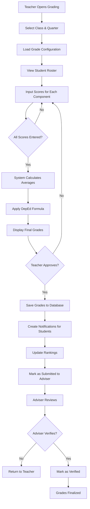
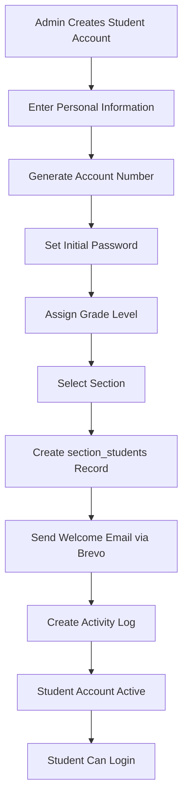
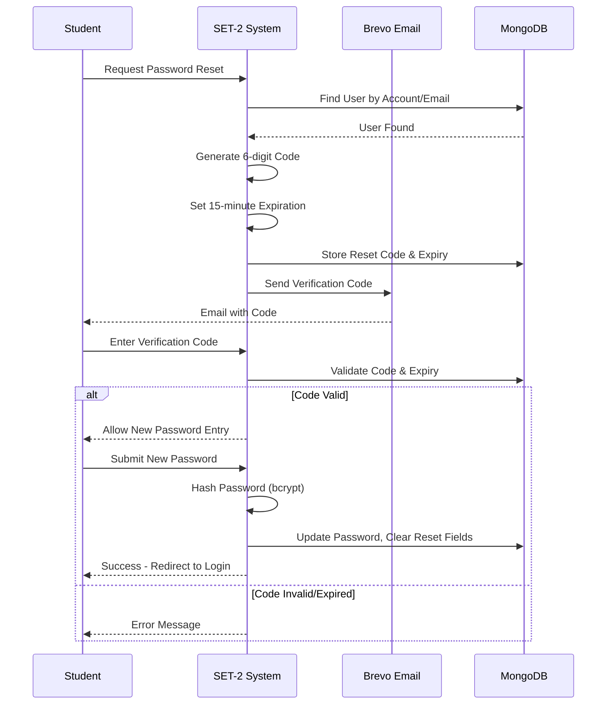
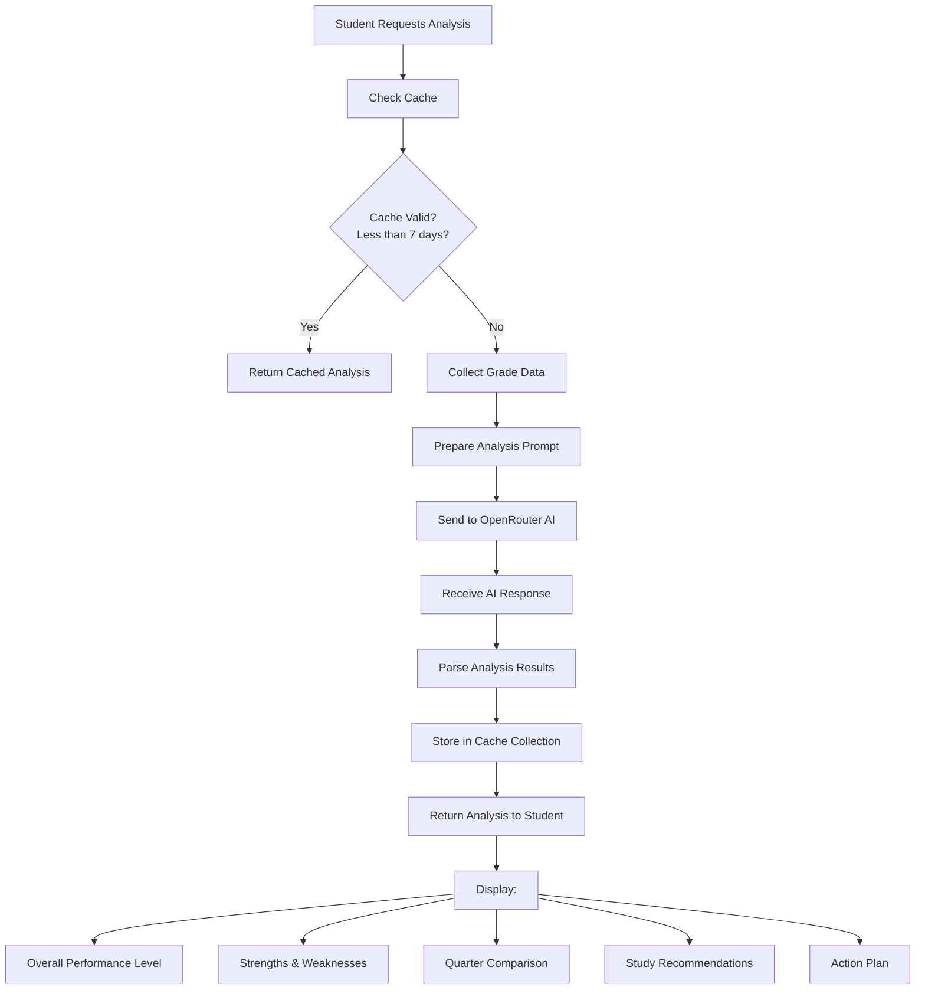
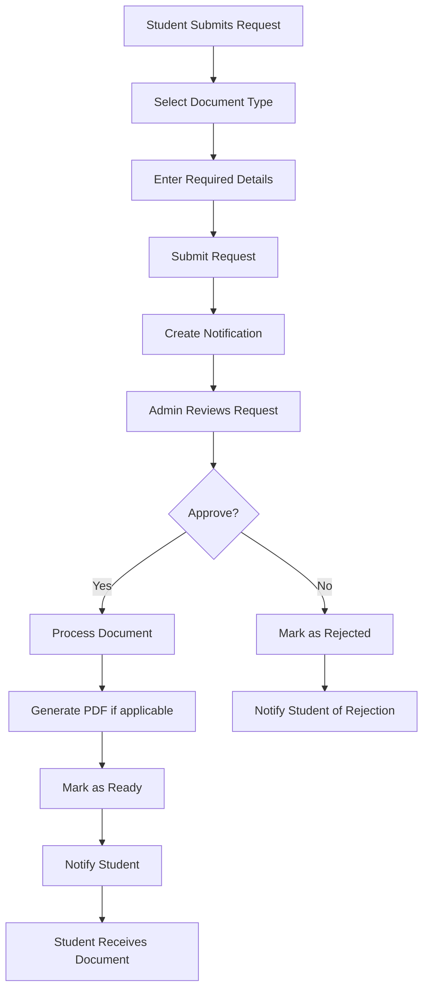
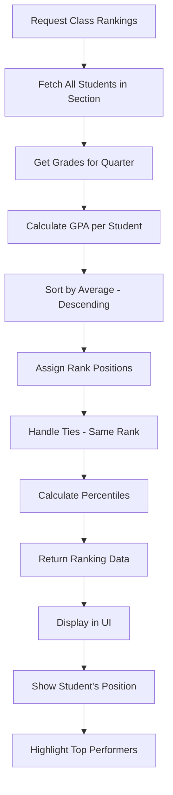
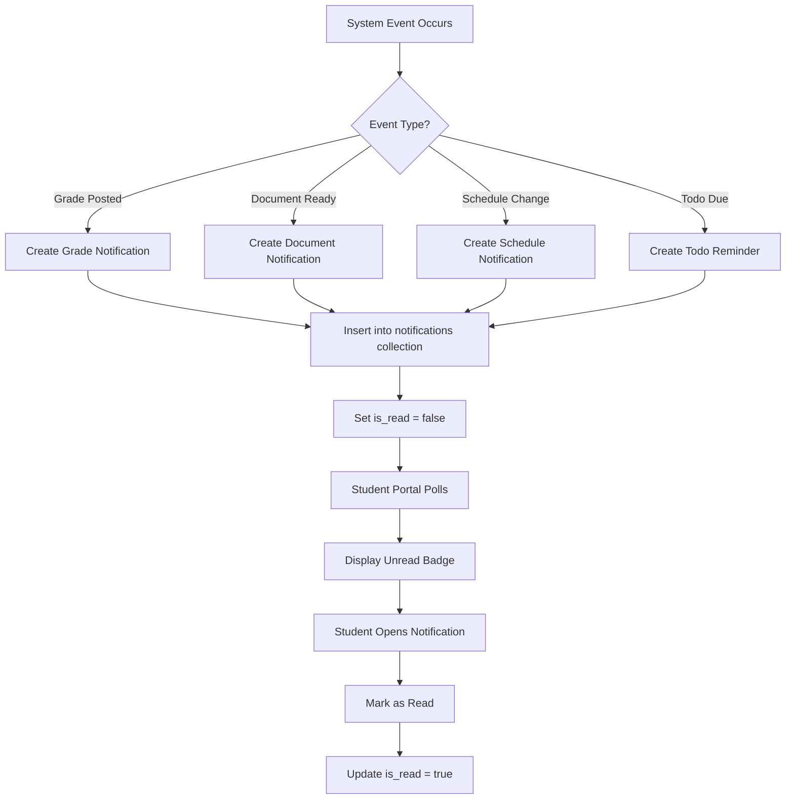
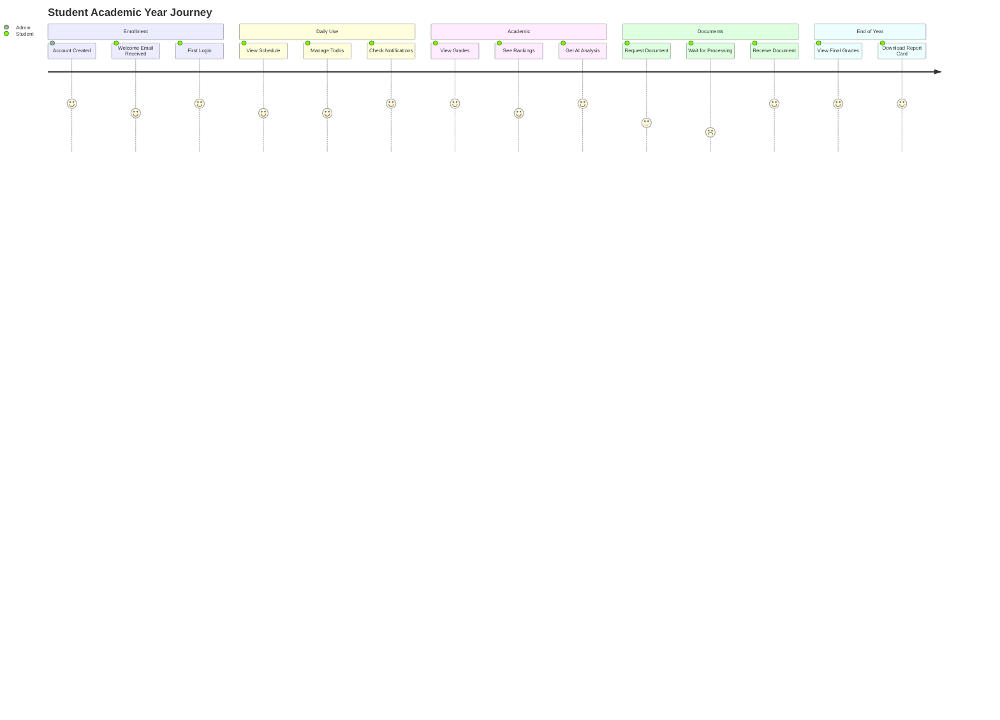
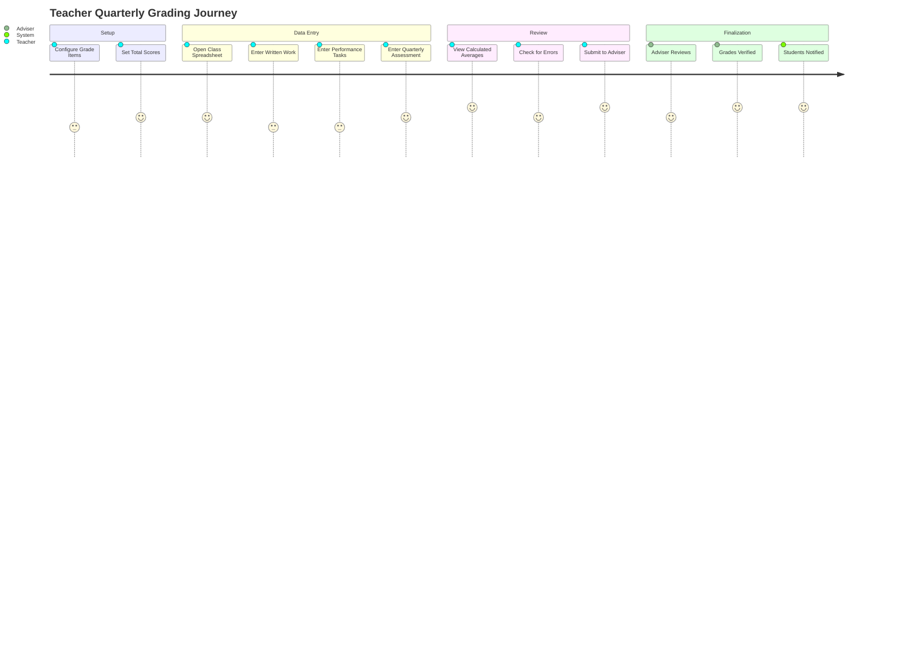
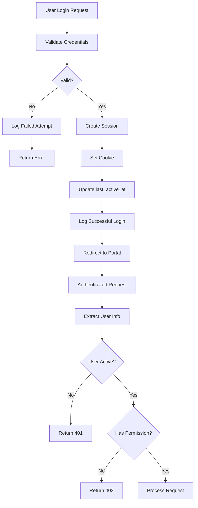

# SET-2 System Business Process Documentation

> **Version**: 1.0  
> **Last Updated**: 2026-02-05  
> **Scope**: SS1 - Student Information System for Philippine High Schools (Grades 7-10)

---

## Table of Contents

1. [Business Overview](#business-overview)
2. [Technology Stack](#technology-stack)
3. [System Architecture](#system-architecture)
4. [User Roles and Permissions](#user-roles-and-permissions)
5. [Core Business Processes](#core-business-processes)
6. [Process Flow Diagrams](#process-flow-diagrams)
7. [Integration Points](#integration-points)
8. [Data Management](#data-management)
9. [Security Framework](#security-framework)
10. [Deployment Architecture](#deployment-architecture)

---

## Business Overview

### Purpose

The SET-2 Student Information System (SS1) is a comprehensive web-based platform designed specifically for Philippine Junior High Schools (Grades 7-10) following the Department of Education (DepEd) K-12 curriculum. The system streamlines academic management, grade tracking, and communication between students, teachers, and administrators.

### Business Objectives

| Objective | Description |
|-----------|-------------|
| **Centralized Academic Management** | Single platform for managing student grades, schedules, and academic records |
| **DepEd Compliance** | Implements official grading formula (WW: 30%, PT: 50%, QA: 20%) |
| **Real-time Grade Tracking** | Students and teachers can view/update grades instantly |
| **AI-Powered Insights** | Automated performance analysis and study recommendations |
| **Document Management** | Digital document request workflow (Form 137, Good Moral, etc.) |
| **Enhanced Communication** | Notification system for grades, schedules, and announcements |

### Target Users

- **Students**: Grades 7-10 (ages 12-16)
- **Teachers**: Subject teachers and class advisers
- **Administrators**: School administrative staff

---

## Technology Stack

### Frontend Technologies

| Technology | Version | Purpose |
|------------|---------|---------|
| **Svelte 5** | ^5.0.0 | Component-based reactive UI framework |
| **SvelteKit 2** | ^2.22.0 | Full-stack meta-framework with SSR |
| **Vite 7** | ^7.0.4 | Fast build tool and development server |
| **Chart.js 4** | ^4.5.1 | Interactive data visualization |
| **CountUp.js 2** | ^2.9.0 | Animated number counters for dashboards |
| **vite-plugin-pwa** | ^1.1.0 | Progressive Web App capabilities |

### Backend Technologies

| Technology | Version | Purpose |
|------------|---------|---------|
| **Node.js 22** | 22.x | JavaScript runtime environment |
| **SvelteKit API Routes** | - | RESTful API endpoints |
| **MongoDB** | ^6.20.0 | NoSQL document database |
| **bcrypt 6** | ^6.0.0 | Password hashing (12 salt rounds) |
| **dotenv 17** | ^17.2.2 | Environment configuration |

### External Integrations

| Service | Purpose | Protocol |
|---------|---------|----------|
| **Brevo Email API** | Email delivery (welcome, password reset, notifications) | HTTPS REST |
| **OpenRouter AI** | Grade analysis and chatbot functionality | HTTPS REST |
| **Google Gemini AI** | Alternative AI analysis and generation | HTTPS REST |

### Additional Libraries

| Library | Version | Purpose |
|---------|---------|---------|
| **pdfkit** | ^0.17.2 | PDF document generation |
| **xlsx** | ^0.18.5 | Excel file handling for import/export |
| **node-fetch 3** | ^3.3.2 | HTTP client for API calls |
| **@google/generative-ai** | ^0.24.1 | Google Gemini AI integration |

### Development Tools

| Tool | Version | Purpose |
|------|---------|---------|
| **ESLint 9** | ^9.18.0 | Code linting and quality |
| **Prettier 3** | ^3.4.2 | Code formatting |
| **Sharp** | ^0.34.5 | Image processing for PWA icons |

---

## System Architecture

### Layered Architecture

```
┌─────────────────────────────────────────────────────────────────┐
│                     PRESENTATION LAYER                          │
│  ┌─────────────────┐ ┌─────────────────┐ ┌─────────────────┐   │
│  │ Student Portal  │ │ Teacher Portal  │ │  Admin Portal   │   │
│  │  - Grades       │ │  - Grading      │ │  - User Mgmt    │   │
│  │  - Rankings     │ │  - Classes      │ │  - Sections     │   │
│  │  - Schedule     │ │  - Advisory     │ │  - Analytics    │   │
│  │  - Todos        │ │  - Schedule     │ │  - Documents    │   │
│  │  - Profile      │ │  - Profile      │ │  - Settings     │   │
│  └─────────────────┘ └─────────────────┘ └─────────────────┘   │
└─────────────────────────────────────────────────────────────────┘
                              │
                              ▼
┌─────────────────────────────────────────────────────────────────┐
│                      APPLICATION LAYER                          │
│  ┌───────────────────────────────────────────────────────────┐  │
│  │                   SvelteKit Framework                      │  │
│  │  ┌─────────────┐ ┌─────────────┐ ┌─────────────────────┐  │  │
│  │  │   Svelte    │ │   Server    │ │     API Routes      │  │  │
│  │  │ Components  │ │    Side     │ │  (/api/grades,      │  │  │
│  │  │  (Reactive) │ │  Rendering  │ │   /api/auth, etc.)  │  │  │
│  │  └─────────────┘ └─────────────┘ └─────────────────────┘  │  │
│  └───────────────────────────────────────────────────────────┘  │
└─────────────────────────────────────────────────────────────────┘
                              │
                              ▼
┌─────────────────────────────────────────────────────────────────┐
│                      BUSINESS LOGIC LAYER                       │
│  ┌─────────────┐ ┌─────────────┐ ┌─────────────┐ ┌───────────┐ │
│  │   Grade     │ │  Ranking    │ │Notification │ │  Document │ │
│  │ Calculator  │ │   Engine    │ │   Manager   │ │  Workflow │ │
│  │ (DepEd     │ │ (GPA Sort,  │ │(Create,     │ │ (Request, │ │
│  │  Formula)  │ │ Percentile) │ │ Deliver)    │ │  Approve) │ │
│  └─────────────┘ └─────────────┘ └─────────────┘ └───────────┘ │
└─────────────────────────────────────────────────────────────────┘
                              │
                              ▼
┌─────────────────────────────────────────────────────────────────┐
│                       DATA ACCESS LAYER                         │
│  ┌───────────────────────────────────────────────────────────┐  │
│  │                    MongoDB Driver                          │  │
│  │  - Connection Pooling    - Query Optimization              │  │
│  │  - Aggregation Pipelines - Index Management                │  │
│  └───────────────────────────────────────────────────────────┘  │
└─────────────────────────────────────────────────────────────────┘
                              │
                              ▼
┌─────────────────────────────────────────────────────────────────┐
│                       DATA STORAGE LAYER                        │
│  ┌───────────────────────────────────────────────────────────┐  │
│  │                    MongoDB Database                        │  │
│  │  Collections: users, grades, sections, subjects,          │  │
│  │  section_students, notifications, student_todos,          │  │
│  │  grade_configurations, activity_logs, ai_cache            │  │
│  └───────────────────────────────────────────────────────────┘  │
└─────────────────────────────────────────────────────────────────┘
                              │
                              ▼
┌─────────────────────────────────────────────────────────────────┐
│                    EXTERNAL SERVICES                            │
│  ┌─────────────┐ ┌─────────────────┐ ┌─────────────────────┐   │
│  │   Brevo    │ │   OpenRouter    │ │   Google Gemini     │   │
│  │  Email API │ │      AI API     │ │       AI API        │   │
│  │  (SMTP)    │ │ (LLM Analysis)  │ │   (Generation)      │   │
│  └─────────────┘ └─────────────────┘ └─────────────────────┘   │
└─────────────────────────────────────────────────────────────────┘
```

### API Route Structure

```
/api
├── /auth              # Authentication (login/logout)
├── /accounts          # User account management
├── /grades            # Grade CRUD operations
├── /student-grades    # Student-specific grade views
├── /class-rankings    # Class ranking calculations
├── /sections          # Section management
├── /subjects          # Subject catalog
├── /schedules         # Schedule management
├── /notifications     # Notification system
├── /student-todos     # Todo list management
├── /document-requests # Document request workflow
├── /ai-grade-analysis # AI-powered grade insights
├── /ai-chatbot        # AI assistant functionality
├── /forgot-password   # Password reset flow
├── /change-password   # Password update
├── /activity-logs     # Audit trail
├── /dashboard         # Dashboard statistics
└── /helper            # Utility functions
```

---

## User Roles and Permissions

### Role Hierarchy

```
┌──────────────────────────────────────────────────────┐
│                  ADMINISTRATOR                        │
│  Full system access, user management, configuration  │
└──────────────────────────────────────────────────────┘
                          │
          ┌───────────────┴───────────────┐
          ▼                               ▼
┌──────────────────────┐      ┌──────────────────────┐
│       TEACHER        │      │       ADVISER        │
│ Grade input, class   │      │ (Teacher + Advisory  │
│ management           │      │  responsibilities)   │
└──────────────────────┘      └──────────────────────┘
                          │
                          ▼
              ┌──────────────────────┐
              │       STUDENT        │
              │ View grades, todos,  │
              │ request documents    │
              └──────────────────────┘
```

### Permission Matrix

| Feature | Student | Teacher | Adviser | Admin |
|---------|:-------:|:-------:|:-------:|:-----:|
| View Own Grades | ✅ | ✅ | ✅ | ✅ |
| View Class Grades | ❌ | ✅ | ✅ | ✅ |
| Input/Edit Grades | ❌ | ✅ | ✅ | ✅ |
| Verify Grades | ❌ | ✅ | ✅ | ✅ |
| View Class Rankings | ✅ | ✅ | ✅ | ✅ |
| Manage Sections | ❌ | ❌ | ❌ | ✅ |
| Manage Users | ❌ | ❌ | ❌ | ✅ |
| View All Students | ❌ | ❌ | ✅ | ✅ |
| Process Documents | ❌ | ❌ | ❌ | ✅ |
| Request Documents | ✅ | ❌ | ❌ | ❌ |
| Manage Own Todos | ✅ | ❌ | ❌ | ❌ |
| View Activity Logs | ❌ | ❌ | ❌ | ✅ |
| AI Grade Analysis | ✅ | ✅ | ✅ | ✅ |
| System Settings | ❌ | ❌ | ❌ | ✅ |

---

## Core Business Processes

### Process 1: Grade Management Workflow



**DepEd Grading Formula:**
```
Final Grade = (Written Work × 0.30) + (Performance Tasks × 0.50) + (Quarterly Assessment × 0.20)
```

**Grade Scale:**
- 90-100: Outstanding
- 85-89: Very Satisfactory
- 80-84: Satisfactory
- 75-79: Fairly Satisfactory
- Below 75: Did Not Meet Expectations

---

### Process 2: Student Registration and Enrollment



**Required Student Information:**
- Account Number (unique identifier)
- First Name, Last Name, Middle Initial
- Gender, Birthdate, Age
- Grade Level (7, 8, 9, or 10)
- Email Address (optional)
- Guardian Name and Contact

---

### Process 3: Password Reset Flow



---

### Process 4: AI-Powered Grade Analysis



**Analysis Components:**
- Overall insight and performance level
- Quarter-over-quarter comparison with trends
- Subject-by-subject strengths identification
- Areas for growth and improvement
- Personalized study recommendations
- Actionable study plan

---

### Process 5: Document Request Workflow



**Available Document Types:**
- Form 137 (Permanent Record)
- Good Moral Certificate
- Certificate of Enrollment
- Report Card
- Transcript of Records

---

### Process 6: Class Ranking Calculation



**Ranking Algorithm:**
```javascript
// Aggregation pipeline for ranking
[
  { $match: { section_id, quarter, school_year } },
  { $group: {
      _id: "$student_id",
      average: { $avg: "$averages.final_grade" }
  }},
  { $sort: { average: -1 } },
  { $setWindowFields: {
      sortBy: { average: -1 },
      output: { rank: { $rank: {} } }
  }}
]
```

---

### Process 7: Notification Lifecycle



**Notification Types:**
| Type | Priority | Description |
|------|----------|-------------|
| grades | high | New grades posted by teacher |
| documents | medium | Document request status update |
| schedule | medium | Class schedule changes |
| todo | low | Task due date reminders |

---

## Process Flow Diagrams

### End-to-End Student Journey



### Teacher Grading Workflow



---

## Integration Points

### External Service Integrations

```
┌─────────────────────────────────────────────────────────────────┐
│                      SET-2 SYSTEM                               │
└─────────────────────────────────────────────────────────────────┘
            │                    │                    │
            ▼                    ▼                    ▼
┌─────────────────┐  ┌─────────────────┐  ┌─────────────────────┐
│   BREVO EMAIL   │  │  OPENROUTER AI  │  │   GOOGLE GEMINI     │
│     SERVICE     │  │     SERVICE     │  │      SERVICE        │
├─────────────────┤  ├─────────────────┤  ├─────────────────────┤
│ Authentication: │  │ Authentication: │  │ Authentication:     │
│ API Key         │  │ API Key         │  │ API Key             │
│                 │  │                 │  │                     │
│ Endpoints:      │  │ Endpoints:      │  │ Package:            │
│ api.brevo.com   │  │ openrouter.ai   │  │ @google/generative- │
│                 │  │                 │  │ ai                  │
│ Functions:      │  │ Functions:      │  │                     │
│ • Send emails   │  │ • Grade analysis│  │ Functions:          │
│ • Track delivery│  │ • Chatbot       │  │ • AI generation     │
│                 │  │ • Recommendations│ │ • Analysis          │
└─────────────────┘  └─────────────────┘  └─────────────────────┘
```

### API Integration Details

#### Brevo Email API
```javascript
// Configuration
{
  host: 'api.brevo.com',
  authentication: 'API Key in headers',
  endpoints: ['/v3/smtp/email']
}

// Email Types Sent
- Welcome emails (new account)
- Password reset codes (6-digit, 15-min expiry)
- Grade notifications
- Document ready notifications
```

#### OpenRouter AI API
```javascript
// Configuration
{
  host: 'openrouter.ai',
  authentication: 'Bearer token',
  models: 'Various LLMs'
}

// Use Cases
- Student grade performance analysis
- Quarter-over-quarter comparisons
- Personalized study recommendations
- AI chatbot for inquiries
```

### Caching Strategy

| Cache Type | Location | TTL | Invalidation |
|------------|----------|-----|--------------|
| AI Analysis | MongoDB (ai_grade_analysis_cache) | 7 days | Manual or TTL expiry |
| Profile Data | Client-side store | 5 minutes | On update |
| Grade Data | Client-side store | 30 seconds | On refresh |
| Schedule | Client-side store | 1 hour | On change |

---

## Data Management

### Database Collections Overview

```
┌────────────────────────────────────────────────────────────────────┐
│                     MONGODB DATABASE STRUCTURE                      │
├────────────────────────────────────────────────────────────────────┤
│                                                                    │
│  CORE COLLECTIONS                                                  │
│  ┌──────────────┐ ┌──────────────┐ ┌──────────────┐               │
│  │    users     │ │   sections   │ │   subjects   │               │
│  │ (Students,   │ │ (Grade       │ │ (Curriculum  │               │
│  │  Teachers,   │ │  levels &    │ │  subjects)   │               │
│  │  Admins)     │ │  classes)    │ │              │               │
│  └──────────────┘ └──────────────┘ └──────────────┘               │
│         │                │                │                        │
│         └────────────────┼────────────────┘                        │
│                          ▼                                         │
│  ENROLLMENT & GRADES                                               │
│  ┌──────────────────┐ ┌────────────────┐ ┌────────────────────┐   │
│  │ section_students │ │     grades     │ │ grade_configurations│   │
│  │ (Enrollment      │ │ (WW, PT, QA    │ │ (Grade items &     │   │
│  │  records)        │ │  scores)       │ │  total scores)     │   │
│  └──────────────────┘ └────────────────┘ └────────────────────┘   │
│                                                                    │
│  STUDENT FEATURES                                                  │
│  ┌──────────────────┐ ┌────────────────┐ ┌────────────────────┐   │
│  │  student_todos   │ │  notifications │ │ document_requests  │   │
│  │ (Task            │ │ (Alerts &      │ │ (Form 137, etc.)   │   │
│  │  management)     │ │  updates)      │ │                    │   │
│  └──────────────────┘ └────────────────┘ └────────────────────┘   │
│                                                                    │
│  SYSTEM & ANALYTICS                                                │
│  ┌──────────────────┐ ┌────────────────┐ ┌────────────────────┐   │
│  │  activity_logs   │ │ admin_settings │ │ai_grade_analysis_  │   │
│  │ (Audit trail)    │ │ (System config)│ │cache               │   │
│  └──────────────────┘ └────────────────┘ └────────────────────┘   │
│                                                                    │
│  SCHEDULING & RESOURCES                                            │
│  ┌──────────────────┐ ┌────────────────┐ ┌────────────────────┐   │
│  │    schedules     │ │     rooms      │ │    departments     │   │
│  │ (Timetables)     │ │ (Classrooms)   │ │ (Subject groups)   │   │
│  └──────────────────┘ └────────────────┘ └────────────────────┘   │
│                                                                    │
└────────────────────────────────────────────────────────────────────┘
```

### Data Relationships

```
users (students) ─────┬───── section_students ─────── sections
                      │
                      ├───── grades ─────── subjects
                      │        │
                      │        └───── grade_configurations
                      │
                      ├───── student_todos
                      │
                      ├───── notifications
                      │
                      ├───── document_requests
                      │
                      └───── ai_grade_analysis_cache
                      
users (teachers) ─────┬───── sections (as adviser)
                      │
                      └───── grades (as teacher_id)
```

### Data Retention Policy

| Collection | Retention Period | Archive Strategy |
|------------|------------------|------------------|
| users | Indefinite | Soft delete (archived_at) |
| grades | Indefinite | Historical record keeping |
| document_requests | 5 years | Compliance requirement |
| notifications | 1 year | Auto-delete old records |
| activity_logs | 2 years | Archive to cold storage |
| student_todos | Active only | Delete 1 year after completion |
| ai_grade_analysis_cache | 7 days | Auto-expire (TTL) |

---

## Security Framework

### Authentication & Authorization



### Security Measures

| Security Layer | Implementation |
|----------------|----------------|
| **Password Hashing** | bcrypt with 12 salt rounds |
| **Session Management** | Encrypted session cookies |
| **Role-Based Access** | Middleware authorization checks |
| **Input Validation** | Server-side validation on all endpoints |
| **XSS Prevention** | Svelte's built-in content escaping |
| **Activity Logging** | Comprehensive audit trail |
| **HTTPS** | Required in production environment |
| **Rate Limiting** | Applied to sensitive endpoints |

### Data Encryption

```
┌────────────────────────────────────────────────────┐
│                 ENCRYPTION POINTS                  │
├────────────────────────────────────────────────────┤
│                                                    │
│  AT REST:                                          │
│  • Passwords: bcrypt hashed (never stored plain)  │
│  • Sensitive user data: encrypted fields          │
│                                                    │
│  IN TRANSIT:                                       │
│  • All API calls: HTTPS (production)              │
│  • External APIs: TLS encrypted                   │
│                                                    │
│  CLIENT SIDE:                                      │
│  • Session data: encrypted in storage             │
│                                                    │
└────────────────────────────────────────────────────┘
```

---

## Deployment Architecture

### Development Environment

```
┌─────────────────────────────────────────────────────┐
│                 DEVELOPER MACHINE                   │
├─────────────────────────────────────────────────────┤
│                                                     │
│  $ npm run dev                                      │
│       │                                             │
│       ▼                                             │
│  ┌─────────────────┐                                │
│  │ Vite Dev Server │ ◄──── Hot Module Replacement   │
│  │   Port: 5173    │                                │
│  └────────┬────────┘                                │
│           │                                         │
│           ▼                                         │
│  ┌─────────────────┐                                │
│  │ Local MongoDB   │                                │
│  │   Port: 27017   │                                │
│  └─────────────────┘                                │
│                                                     │
│  Features:                                          │
│  • Hot module replacement                           │
│  • Source maps for debugging                        │
│  • Console logging enabled                          │
│  • No SSL required                                  │
│                                                     │
└─────────────────────────────────────────────────────┘
```

### Production Environment

```
┌─────────────────────────────────────────────────────────────────────┐
│                      PRODUCTION DEPLOYMENT                          │
├─────────────────────────────────────────────────────────────────────┤
│                                                                     │
│     INTERNET                                                        │
│        │                                                            │
│        ▼                                                            │
│  ┌─────────────────────────┐                                        │
│  │   REVERSE PROXY         │                                        │
│  │   (Nginx/Caddy)         │                                        │
│  │   Port: 443 (HTTPS)     │                                        │
│  │   SSL/TLS Termination   │                                        │
│  └───────────┬─────────────┘                                        │
│              │                                                      │
│              ▼                                                      │
│  ┌─────────────────────────┐      ┌────────────────────────────┐   │
│  │   APPLICATION SERVER    │      │     EXTERNAL SERVICES      │   │
│  │   ┌─────────────────┐   │      │                            │   │
│  │   │   PM2 Process   │   │◄────►│   • Brevo (Email)          │   │
│  │   │    Manager      │   │      │   • OpenRouter (AI)        │   │
│  │   │   ┌─────────┐   │   │      │   • Google Gemini (AI)     │   │
│  │   │   │ Node.js │   │   │      │                            │   │
│  │   │   │  Port   │   │   │      └────────────────────────────┘   │
│  │   │   │  3000   │   │   │                                        │
│  │   │   └─────────┘   │   │                                        │
│  │   └─────────────────┘   │                                        │
│  └───────────┬─────────────┘                                        │
│              │                                                      │
│              ▼                                                      │
│  ┌─────────────────────────┐                                        │
│  │      MONGODB            │                                        │
│  │  (Atlas or Self-hosted) │                                        │
│  │  Connection Pooling     │                                        │
│  │  SSL/TLS Enabled        │                                        │
│  └─────────────────────────┘                                        │
│                                                                     │
└─────────────────────────────────────────────────────────────────────┘
```

### Environment Variables

```bash
# Database
MONGODB_URI=mongodb://localhost:27017/set-2-system  # or MongoDB Atlas URL

# External Services
BREVO_API_KEY=your-brevo-api-key
OPENROUTER_API_KEY=your-openrouter-api-key
GEMINI_API_KEY=your-gemini-api-key

# Application
NODE_ENV=production
PORT=3000
```

### Scalability Considerations

```
                    LOAD BALANCER
                         │
          ┌──────────────┼──────────────┐
          │              │              │
          ▼              ▼              ▼
    ┌──────────┐   ┌──────────┐   ┌──────────┐
    │  App     │   │  App     │   │  App     │
    │ Server 1 │   │ Server 2 │   │ Server 3 │
    └────┬─────┘   └────┬─────┘   └────┬─────┘
         │              │              │
         └──────────────┼──────────────┘
                        │
                        ▼
              ┌─────────────────┐
              │  MongoDB        │
              │  Replica Set    │
              │  (Primary +     │
              │   Secondaries)  │
              └─────────────────┘
```

**Scaling Strategies:**
- **Horizontal**: Multiple app servers behind load balancer
- **Vertical**: Increase server resources as needed
- **Database**: MongoDB replica sets for high availability

---

## Summary

The SET-2 Student Information System is a comprehensive, modern web application built with cutting-edge technologies (Svelte 5, SvelteKit 2, MongoDB) designed specifically for Philippine high schools following the DepEd curriculum. Key highlights include:

| Aspect | Description |
|--------|-------------|
| **Architecture** | Layered architecture with clear separation of concerns |
| **Technology** | Modern JavaScript stack with SSR and PWA capabilities |
| **Grading** | Full DepEd compliance with 30/50/20 formula |
| **AI Integration** | Smart grade analysis via OpenRouter and Google Gemini |
| **Security** | bcrypt hashing, role-based access, comprehensive logging |
| **Scalability** | Designed for horizontal scaling with MongoDB clusters |

---

## Related Documentation

- [ContextDiagram.md](./ContextDiagram.md) - System context and external actors
- [DataDictionary.md](./DataDictionary.md) - Database schema documentation
- [DataFlow.md](./DataFlow.md) - Detailed data flow diagrams
- [database-schema.md](./database-schema.md) - Technical database schema

---

## Document History

| Version | Date | Author | Changes |
|---------|------|--------|---------|
| 1.0 | 2026-02-05 | SET-2 Development Team | Initial business process documentation |
