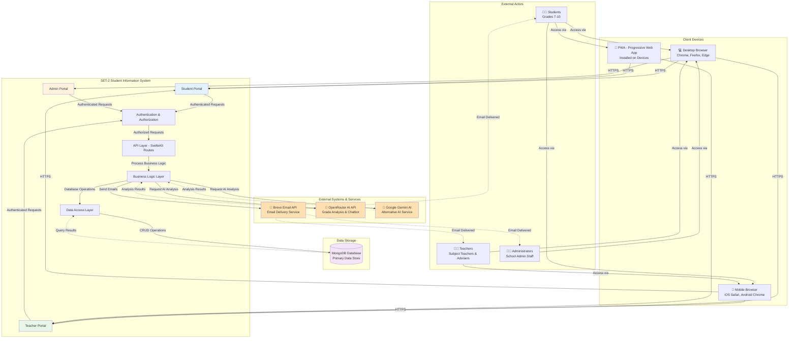
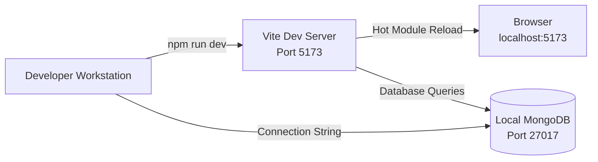
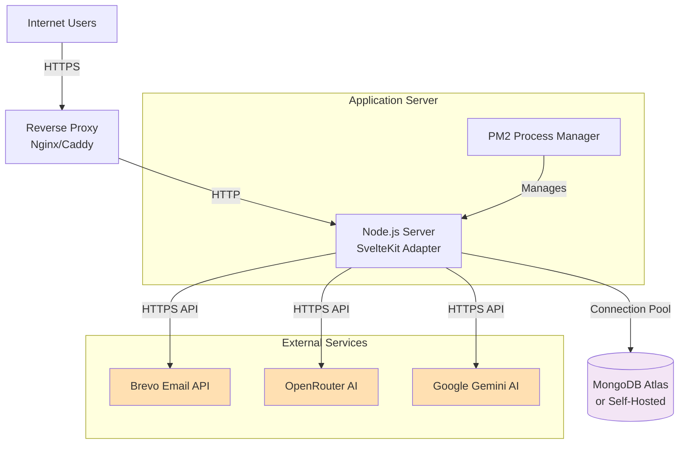
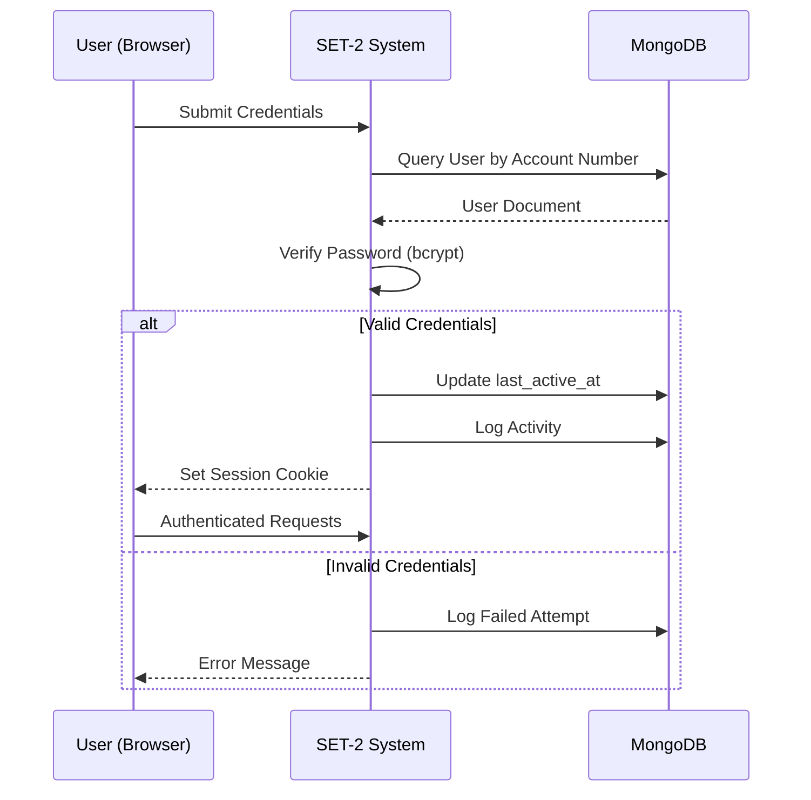
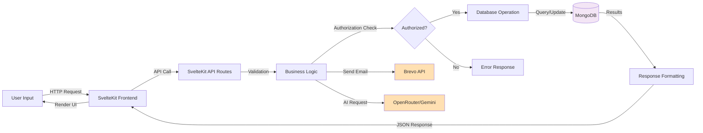
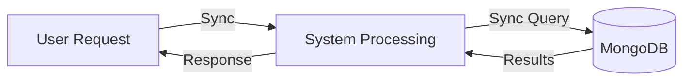
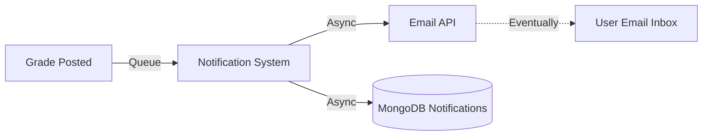
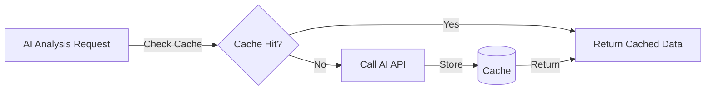

# SET-2 System Context Diagram (SS1 - Student Information System)

> **Branch Context**: This document provides a comprehensive context diagram for SS1 (Student Information System) branch of the SET-2 system, showing the system's boundaries, external actors, and interactions with external services.

## Overview

The SET-2 Student Information System is a web-based application designed for Philippine high school students (Grades 7-10) following the DepEd curriculum. This context diagram illustrates the system's place within its operational environment, showing all external entities that interact with the system and the nature of those interactions.

---

## System Context Diagram



---

## System Boundary

### What's Inside the System

The SET-2 Student Information System includes:

1. **User Interface Layer**
   - Student Portal (grade viewing, profile management, schedule, document requests, notifications, todo list)
   - Teacher Portal (class management, grading, advisory, schedule)
   - Admin Portal (user management, system configuration, analytics dashboard)

2. **Application Layer**
   - SvelteKit-based frontend framework
   - Server-side rendering (SSR) and client-side hydration
   - Progressive Web App (PWA) capabilities
   - Responsive design for mobile and desktop

3. **API Layer**
   - RESTful API endpoints built with SvelteKit API routes
   - Authentication and authorization middleware
   - Request validation and error handling
   - Rate limiting and security controls

4. **Business Logic Layer**
   - Grade calculation engine (DepEd formula: WW 30%, PT 50%, QA 20%)
   - Class ranking algorithms
   - Notification management
   - Document request workflows
   - Schedule conflict detection
   - Todo list management

5. **Data Access Layer**
   - MongoDB ODM (Object-Document Mapping)
   - Database connection pooling
   - Query optimization
   - Caching strategies

### What's Outside the System

The SET-2 system relies on but does not include:

1. **Email Infrastructure** - Brevo API handles all email delivery
2. **AI Processing** - OpenRouter and Google Gemini provide AI capabilities
3. **Database Server** - MongoDB server is external infrastructure
4. **Network Infrastructure** - Internet connectivity and routing
5. **Client Hardware** - User devices (computers, tablets, smartphones)
6. **Web Browsers** - Chrome, Firefox, Safari, Edge, etc.

---

## External Actors

### 1. Students (Primary Users)
**Role**: End users consuming educational services

**System Interactions**:
- 🔐 **Authentication**: Login with account number and password
- 📊 **View Grades**: Access quarterly grades with AI-powered analysis
- 📈 **View Rankings**: Check class rank and section performance
- 📅 **View Schedule**: Access class schedule and timetable
- 📄 **Request Documents**: Submit document requests (Form 137, Good Moral, etc.)
- 🔔 **Receive Notifications**: Get updates on grades, schedules, and documents
- ✅ **Manage Tasks**: Create and track todo items with due dates
- 👤 **Manage Profile**: View and update personal information
- 🔑 **Reset Password**: Request and complete password reset via email

**Access Methods**:
- Desktop web browser
- Mobile web browser
- Progressive Web App (PWA) on mobile devices

**Demographics**:
- Grade levels: 7, 8, 9, 10 (Junior High School)
- Age range: 12-16 years old
- Location: Philippines (DepEd curriculum)

---

### 2. Teachers (Power Users)
**Role**: Content providers and grade managers

**System Interactions**:
- 🔐 **Authentication**: Login with teacher credentials
- 📝 **Manage Grades**: Input, calculate, and verify student grades
- 📊 **Configure Grade Items**: Set up written work, performance tasks, and assessments
- 👥 **Manage Classes**: View class rosters and student information
- 👨‍🏫 **Advisory Functions**: Monitor advisee performance and attendance
- 📅 **View Schedule**: Access teaching schedule and assignments
- 🔔 **Send Notifications**: Notify students about grades and updates
- 👤 **Manage Profile**: View teaching assignments and personal information

**Access Methods**:
- Desktop web browser (primary)
- Mobile web browser (secondary)

**Responsibilities**:
- Grade input and verification
- Student performance monitoring
- Class advisement
- Academic reporting

---

### 3. Administrators (System Managers)
**Role**: System administrators and school staff

**System Interactions**:
- 🔐 **Authentication**: Login with admin credentials
- 👥 **Manage Users**: Create, update, archive student and teacher accounts
- 🏫 **Manage Sections**: Create and assign sections to grade levels
- 📚 **Manage Subjects**: Configure curriculum subjects per grade level
- 📊 **View Analytics**: Access system-wide statistics and reports
- 📄 **Process Documents**: Review and fulfill document requests
- 📅 **Manage Schedules**: Configure school schedules and timetables
- ⚙️ **System Settings**: Configure system parameters and school year
- 📈 **View Activity Logs**: Monitor user activity and system events

**Access Methods**:
- Desktop web browser (primary)

**Responsibilities**:
- User account management
- System configuration
- Data integrity maintenance
- Security and compliance oversight

---

## External Systems and Services

### 1. Brevo Email API (formerly Sendinblue)
**Type**: Third-party Email Service Provider (ESP)

**Purpose**: Handles all outbound email communications

**Integration Details**:
- **Protocol**: HTTPS REST API
- **Authentication**: API Key-based
- **Email Types Sent**:
  - Account creation welcome emails
  - Password reset verification codes (6-digit, 15-minute expiry)
  - Document ready notifications
  - Grade report notifications
  - System announcements

**Data Exchanged**:
- **Outbound**: Recipient email, subject, HTML content, plain text content
- **Inbound**: Delivery status, bounce notifications, open/click tracking

**Dependencies**:
- System cannot send emails without Brevo API connectivity
- Fallback: Email queue for retry on temporary failures

**SLA Expectations**:
- Email delivery within seconds to minutes
- 99%+ delivery rate for valid addresses

---

### 2. OpenRouter AI API
**Type**: Third-party AI Service Aggregator

**Purpose**: Provides AI-powered grade analysis and chatbot functionality

**Integration Details**:
- **Protocol**: HTTPS REST API
- **Authentication**: API Key-based
- **AI Models Used**: Various LLMs (Large Language Models)
- **Features Provided**:
  - Student grade performance analysis
  - Quarter-over-quarter comparison
  - Strengths and improvement areas identification
  - Personalized study recommendations
  - AI chatbot for student inquiries

**Data Exchanged**:
- **Outbound**: Grade data, subject information, historical performance
- **Inbound**: Analysis insights, recommendations, chat responses

**Caching Strategy**:
- AI analysis results cached for 7 days
- Cache key: `${student_id}_${quarter}_${school_year}`
- Reduces API calls and costs

**Dependencies**:
- Grade analysis feature depends on API availability
- Fallback: Display raw grade data without AI insights

---

### 3. Google Gemini AI (Google Generative AI)
**Type**: Third-party AI Service

**Purpose**: Alternative AI provider for analysis and generation tasks

**Integration Details**:
- **Protocol**: HTTPS REST API via `@google/generative-ai` npm package
- **Authentication**: API Key-based
- **Features Provided**:
  - Additional AI analysis capabilities
  - Alternative to OpenRouter for specific tasks

**Data Exchanged**:
- **Outbound**: Prompts, context data
- **Inbound**: Generated responses and analyses

**Usage Context**:
- Backup AI provider
- Specific use cases requiring Google's models

---

## Data Storage

### MongoDB Database
**Type**: NoSQL Document Database (External Infrastructure)

**Purpose**: Primary data persistence layer

**Deployment**:
- **Development**: Local MongoDB instance
- **Production**: MongoDB Atlas (cloud-hosted) or self-hosted server

**Connection Details**:
- **Protocol**: MongoDB Wire Protocol
- **Authentication**: Username/Password or Connection String
- **Connection Pooling**: Managed by MongoDB driver
- **SSL/TLS**: Enabled in production

**Collections (SS1 Focus)**:
- `users` - Student, teacher, and admin accounts
- `sections` - Class sections by grade level
- `section_students` - Student enrollment records
- `subjects` - Academic subjects
- `grades` - Student grades and assessments
- `grade_configurations` - Grade item definitions
- `student_todos` - Student task management
- `notifications` - User notifications
- `activity_logs` - System audit trail
- `ai_grade_analysis_cache` - Cached AI analysis (7-day TTL)
- `pushSubscriptions` - PWA push notification subscriptions

**Data Volume Estimates** (per school year):
- Users: 500-2,000 documents
- Grades: 50,000-200,000 documents
- Activity Logs: 100,000+ documents annually

**Backup & Recovery**:
- Daily automated backups
- Point-in-time recovery capability
- 30-day backup retention

---

## Technology Stack Context

### Frontend Technologies
```
┌─────────────────────────────────────────┐
│ User Interface Layer                    │
├─────────────────────────────────────────┤
│ • Svelte 5 - Component Framework        │
│ • SvelteKit 2 - Meta-Framework          │
│ • Vite 7 - Build Tool                   │
│ • Chart.js 4 - Data Visualization       │
│ • CountUp.js 2 - Animated Counters      │
│ • Material Design 3 - Design System     │
└─────────────────────────────────────────┘
```

### Backend Technologies
```
┌─────────────────────────────────────────┐
│ Server Layer                            │
├─────────────────────────────────────────┤
│ • Node.js 22 - Runtime Environment      │
│ • SvelteKit API Routes - Backend        │
│ • MongoDB 6 - Database Driver           │
│ • bcrypt 6 - Password Hashing           │
│ • dotenv 17 - Environment Config        │
└─────────────────────────────────────────┘
```

### External Libraries
```
┌─────────────────────────────────────────┐
│ Third-Party Integrations                │
├─────────────────────────────────────────┤
│ • @google/generative-ai - Google AI     │
│ • node-fetch 3 - HTTP Client            │
│ • pdfkit 0.17 - PDF Generation          │
│ • xlsx 0.18 - Excel File Handling       │
└─────────────────────────────────────────┘
```

### Development Tools
```
┌─────────────────────────────────────────┐
│ Development Environment                 │
├─────────────────────────────────────────┤
│ • ESLint 9 - Code Linting               │
│ • Prettier 3 - Code Formatting          │
│ • Sharp - Image Processing              │
│ • vite-plugin-pwa - PWA Generation      │
└─────────────────────────────────────────┘
```

---

## Deployment Context

### Development Environment


**Characteristics**:
- Hot module replacement (HMR) for instant updates
- Local MongoDB instance
- Console logging enabled
- Source maps for debugging
- No SSL/TLS requirements

---

### Production Environment


**Deployment Stack**:
- **Adapter**: `@sveltejs/adapter-node` for Node.js deployment
- **Process Manager**: PM2 for application lifecycle management
- **Reverse Proxy**: Nginx or Caddy for SSL/TLS termination
- **SSL/TLS**: Let's Encrypt or commercial certificate
- **Port**: Application runs on port 3000 (configurable)

**Environment Variables Required**:
```
MONGODB_URI=<connection string>
BREVO_API_KEY=<api key>
OPENROUTER_API_KEY=<api key>
GEMINI_API_KEY=<api key>
NODE_ENV=production
PORT=3000
```

---

## Security Context

### Authentication Flow


**Security Measures**:
- ✅ Password hashing with bcrypt (12 salt rounds)
- ✅ Session-based authentication
- ✅ Role-based access control (RBAC)
- ✅ Activity logging for auditing
- ✅ HTTPS in production
- ✅ Rate limiting on sensitive endpoints
- ✅ Input validation and sanitization
- ✅ SQL injection prevention (NoSQL database)
- ✅ XSS protection via Svelte's built-in escaping

---

## Data Flow Context

### High-Level Data Flow


---

## Network Context

### Protocol and Port Usage

| Service | Protocol | Port | Purpose |
|---------|----------|------|---------|
| SvelteKit Dev Server | HTTP | 5173 | Development server |
| SvelteKit Production | HTTP | 3000 | Application server |
| MongoDB | MongoDB Wire | 27017 | Database connection |
| HTTPS (Production) | HTTPS | 443 | Secure web access |
| Reverse Proxy Admin | HTTP | 80 | SSL/TLS redirect |

### Network Dependencies

**Outbound Connections Required**:
- MongoDB server (port 27017 or Atlas URL)
- Brevo API (api.brevo.com, port 443)
- OpenRouter API (openrouter.ai, port 443)
- Google Gemini API (generativelanguage.googleapis.com, port 443)

**Inbound Connections Required**:
- HTTP/HTTPS from user browsers (ports 80/443)

**Firewall Considerations**:
- Allow outbound HTTPS (443) for API calls
- Allow inbound HTTP/HTTPS for web access
- Restrict MongoDB port (27017) to application server only
- Consider VPC or private networking for database in cloud deployments

---

## Integration Patterns

### Synchronous Integrations

**Used For**: Real-time data queries (grades, profiles, schedules)

---

### Asynchronous Integrations

**Used For**: Email notifications, background tasks

---

### Cached Integrations

**Used For**: AI grade analysis (7-day cache TTL)

---

## Scalability Context

### Current Architecture
- **Single-node deployment**: Application runs on one server
- **MongoDB**: Can be replica set or sharded cluster
- **Stateless application**: Horizontal scaling possible with load balancer

### Scaling Considerations

**Horizontal Scaling**:
- Add multiple application servers behind load balancer
- Session stickiness may be required
- MongoDB handles connection pooling from multiple sources

**Vertical Scaling**:
- Increase server CPU/RAM for higher user load
- MongoDB can scale vertically within limits

**Database Scaling**:
- MongoDB replica sets for high availability
- Sharding for very large datasets (>100GB)
- Read replicas for query load distribution

---

## Monitoring and Observability Context

### What Should Be Monitored

**Application Metrics**:
- Request latency and throughput
- Error rates by endpoint
- Active user sessions
- API response times

**Database Metrics**:
- Query performance
- Connection pool utilization
- Index efficiency
- Storage utilization

**External Service Metrics**:
- Email delivery success rate
- AI API response times
- API rate limit consumption
- External service availability

**User Metrics**:
- Login success/failure rates
- Feature usage patterns
- Page load times
- Error encounters

### Logging Strategy

**Activity Logs** (stored in MongoDB):
- User login/logout events
- Grade modifications
- Account changes
- Admin actions
- Failed authentication attempts

**Application Logs** (console/file):
- Error traces
- Performance warnings
- API call logs
- System startup/shutdown

---

## Compliance and Data Privacy Context

### Data Classification

**Sensitive Data**:
- Student passwords (hashed with bcrypt)
- Personal student information (names, birthdates, addresses)
- Contact information (emails, phone numbers)
- Academic records (grades)

**Data Protection Measures**:
- Password hashing (bcrypt, 12 rounds)
- HTTPS encryption in transit
- Role-based access control
- Activity logging for auditing
- Data retention policies (documented in DataFlow.md)

### Philippine Data Privacy Act Considerations

**Personal Information Collected**:
- Student names, addresses, birthdates
- Guardian names and contact information
- Academic performance data
- Email addresses

**Data Subject Rights**:
- Access to personal data (via student portal)
- Correction of data (via profile updates)
- Data portability (export features)
- Erasure (account archival)

---

## System Boundaries Summary

### What the SET-2 System IS
✅ A web-based student information system  
✅ Grade management and calculation platform  
✅ Student performance analytics system  
✅ Class ranking and comparison tool  
✅ Schedule and document management system  
✅ Notification and communication hub  

### What the SET-2 System IS NOT
❌ Not an email service provider (uses Brevo)  
❌ Not an AI/ML platform (uses OpenRouter/Gemini)  
❌ Not a database server (uses MongoDB)  
❌ Not a file storage service  
❌ Not a payment processing system  
❌ Not a video conferencing platform  
❌ Not a learning management system (LMS) with content delivery  

---

## Context Evolution

### Phase 1 (Current - SS1)
- Student information management
- Grade tracking and analysis
- Basic teacher tools
- Admin portal

### Future Phases (Potential)
- SS2: Subject scheduling system
- SS3: Document management system
- SS4: Attendance tracking
- SS5: Parent portal
- SS6: Mobile native apps

---

## Glossary of External Terms

| Term | Definition |
|------|------------|
| **DepEd** | Department of Education (Philippines) |
| **PWA** | Progressive Web App - web app installable on devices |
| **API** | Application Programming Interface |
| **REST** | Representational State Transfer architecture |
| **NoSQL** | Non-relational database (MongoDB) |
| **ODM** | Object-Document Mapping |
| **SSR** | Server-Side Rendering |
| **HMR** | Hot Module Replacement |
| **TTL** | Time To Live (cache expiration) |
| **LLM** | Large Language Model (AI) |
| **ESP** | Email Service Provider |

---

## References and Related Documentation

- **DataDictionary.md**: Detailed database schema and collection documentation
- **DataFlow.md**: Comprehensive data flow diagrams and sequences
- **database-schema.md**: Technical database schema details
- **README.md**: System overview and feature list

---

## Document Metadata

| Attribute | Value |
|-----------|-------|
| **Document Title** | SET-2 System Context Diagram (SS1) |
| **Version** | 1.0 |
| **Created Date** | 2024-02-05 |
| **Last Updated** | 2024-02-05 |
| **Author** | SET-2 Development Team |
| **Scope** | SS1 - Student Information System |
| **Audience** | Developers, System Architects, Stakeholders |

---

## Change Log

| Version | Date | Changes | Author |
|---------|------|---------|--------|
| 1.0 | 2024-02-05 | Initial context diagram for SS1 branch | Development Team |

---

**Note**: This context diagram provides a high-level view of the SET-2 Student Information System's position within its operational environment. It focuses on system boundaries, external actors, and integration points. For detailed implementation specifics, refer to the DataDictionary.md and DataFlow.md documents.
