# SET-2 System Data Flow Diagram (SS1 - Student Information System)

> **Branch Context**: This document focuses on SS1 (Student Information System) data flows within the SET-2 system.

## Overview

This document illustrates the data flows within the SET-2 Student Information System, showing how data moves between users, system components, and the MongoDB database.

---

## System Architecture Overview

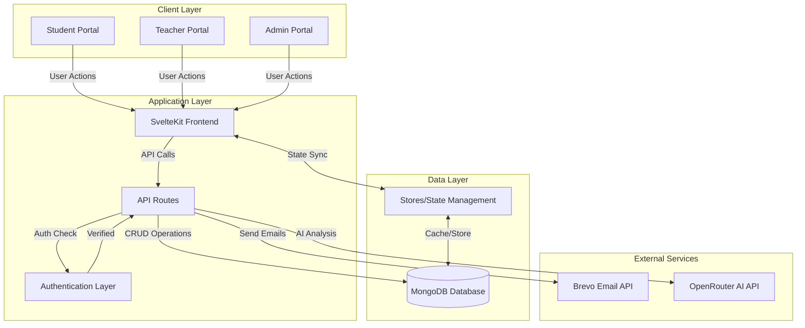
```mermaid
graph TB
    subgraph "Client Layer"
        A[Student Portal]
        B[Teacher Portal]
        C[Admin Portal]
    end
    
    subgraph "Application Layer"
        D[SvelteKit Frontend]
        E[API Routes]
        F[Authentication Layer]
    end
    
    subgraph "Data Layer"
        G[(MongoDB Database)]
        H[Stores/State Management]
    end
    
    subgraph "External Services"
        I[Brevo Email API]
        J[OpenRouter AI API]
    end
    
    A -->|User Actions| D
    B -->|User Actions| D
    C -->|User Actions| D
    D -->|API Calls| E
    E -->|Auth Check| F
    F -->|Verified| E
    E -->|CRUD Operations| G
    E -->|Send Emails| I
    E -->|AI Analysis| J
    D <-->|State Sync| H
    H <-->|Cache/Store| G
```

---

## Core Data Flows

### 1. Student Authentication Flow

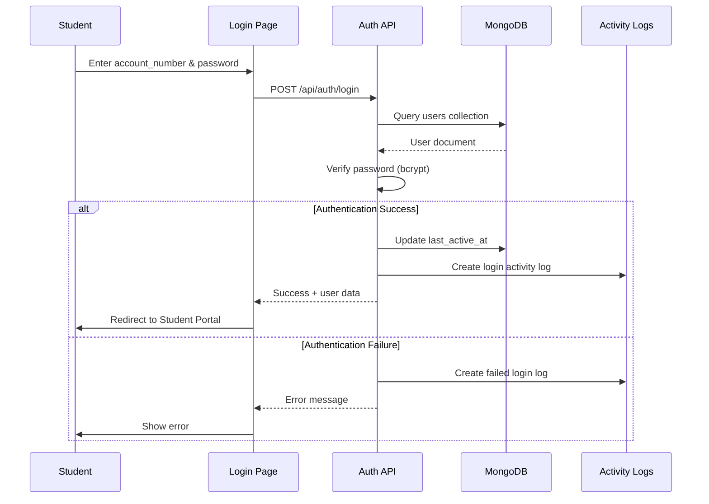
```mermaid
sequenceDiagram
    participant S as Student
    participant UI as Login Page
    participant API as Auth API
    participant DB as MongoDB
    participant Log as Activity Logs
    
    S->>UI: Enter account_number & password
    UI->>API: POST /api/auth/login
    API->>DB: Query users collection
    DB-->>API: User document
    API->>API: Verify password (bcrypt)
    
    alt Authentication Success
        API->>DB: Update last_active_at
        API->>Log: Create login activity log
        API-->>UI: Success + user data
        UI->>S: Redirect to Student Portal
    else Authentication Failure
        API->>Log: Create failed login log
        API-->>UI: Error message
        UI->>S: Show error
    end
```

**Data Collections Involved:**
- `users` (read, update)
- `activity_logs` (create)

**Key Processes:**
1. User submits credentials
2. System queries `users` by `account_number`
3. Bcrypt verification (12 salt rounds)
4. Session creation and activity logging
5. Role-based redirect (student/teacher/admin)

---

### 2. Student Grade Viewing Flow

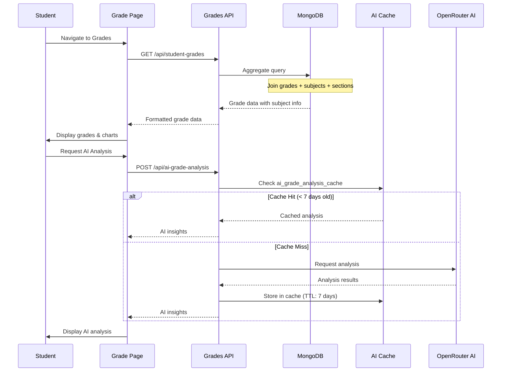
```mermaid
sequenceDiagram
    participant S as Student
    participant UI as Grade Page
    participant API as Grades API
    participant DB as MongoDB
    participant Cache as AI Cache
    participant AI as OpenRouter AI
    
    S->>UI: Navigate to Grades
    UI->>API: GET /api/student-grades
    API->>DB: Aggregate query
    note over DB: Join grades + subjects + sections
    DB-->>API: Grade data with subject info
    API-->>UI: Formatted grade data
    UI->>S: Display grades & charts
    
    S->>UI: Request AI Analysis
    UI->>API: POST /api/ai-grade-analysis
    API->>Cache: Check ai_grade_analysis_cache
    
    alt Cache Hit (< 7 days old)
        Cache-->>API: Cached analysis
        API-->>UI: AI insights
    else Cache Miss
        API->>AI: Request analysis
        AI-->>API: Analysis results
        API->>Cache: Store in cache (TTL: 7 days)
        API-->>UI: AI insights
    end
    
    UI->>S: Display AI analysis
```

**Data Collections Involved:**
- `grades` (read)
- `subjects` (read via lookup)
- `sections` (read via lookup)
- `users` (read via lookup)
- `ai_grade_analysis_cache` (read, create)

**Aggregation Pipeline:**
```javascript
[
  { $match: { student_id: ObjectId(studentId), quarter, school_year } },
  { $lookup: { from: "subjects", localField: "subject_id", foreignField: "_id" } },
  { $lookup: { from: "sections", localField: "section_id", foreignField: "_id" } },
  { $lookup: { from: "users", localField: "teacher_id", foreignField: "_id" } }
]
```

---

### 3. Document Request Submission Flow

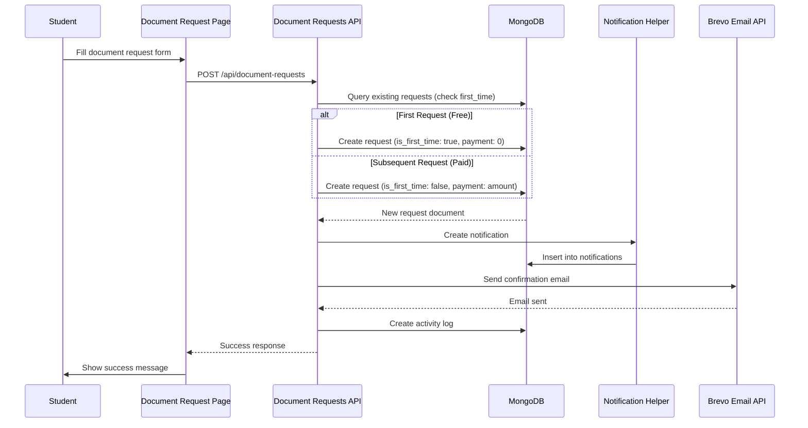
```mermaid
sequenceDiagram
    participant S as Student
    participant UI as Document Request Page
    participant API as Document Requests API
    participant DB as MongoDB
    participant Notify as Notification Helper
    participant Email as Brevo Email API
    
    S->>UI: Fill document request form
    UI->>API: POST /api/document-requests
    API->>DB: Query existing requests (check first_time)
    
    alt First Request (Free)
        API->>DB: Create request (is_first_time: true, payment: 0)
    else Subsequent Request (Paid)
        API->>DB: Create request (is_first_time: false, payment: amount)
    end
    
    DB-->>API: New request document
    API->>Notify: Create notification
    Notify->>DB: Insert into notifications
    API->>Email: Send confirmation email
    Email-->>API: Email sent
    API->>DB: Create activity log
    API-->>UI: Success response
    UI->>S: Show success message
```

**Data Collections Involved:**
- `document_requests` (create, read)
- `notifications` (create)
- `activity_logs` (create)
- `users` (read for student info)

**Business Logic:**
1. Check if student has previous **approved/completed** requests
2. Rejected requests don't count as "first time"
3. Calculate payment: first = ₱0, subsequent = configured amount
4. Generate unique `request_id`
5. Set default status: `pending`

---

### 4. Student Schedule Retrieval Flow

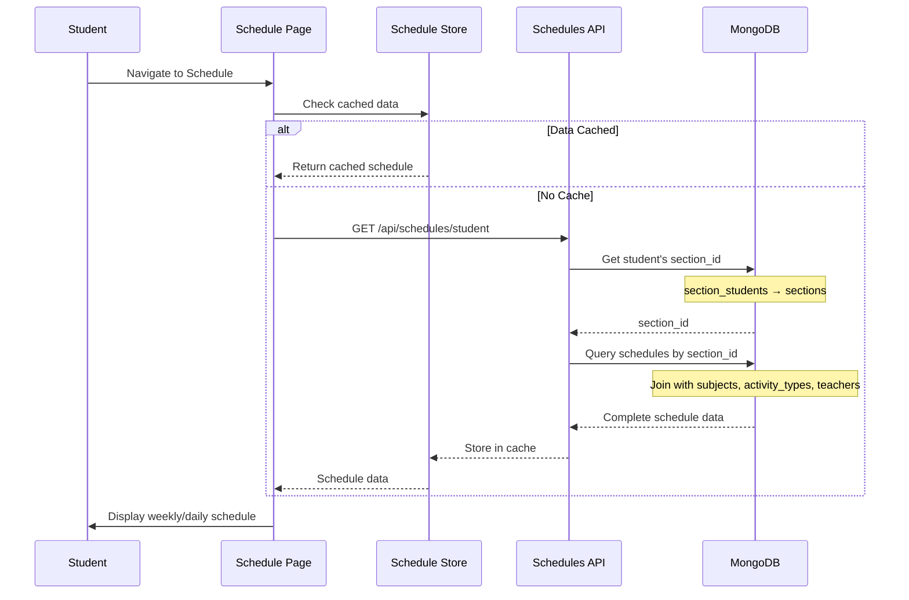
```mermaid
sequenceDiagram
    participant S as Student
    participant UI as Schedule Page
    participant Store as Schedule Store
    participant API as Schedules API
    participant DB as MongoDB
    
    S->>UI: Navigate to Schedule
    UI->>Store: Check cached data
    
    alt Data Cached
        Store-->>UI: Return cached schedule
    else No Cache
        UI->>API: GET /api/schedules/student
        API->>DB: Get student's section_id
        note over DB: section_students → sections
        DB-->>API: section_id
        API->>DB: Query schedules by section_id
        note over DB: Join with subjects, activity_types, teachers
        DB-->>API: Complete schedule data
        API-->>Store: Store in cache
        Store-->>UI: Schedule data
    end
    
    UI->>S: Display weekly/daily schedule
```

**Data Collections Involved:**
- `section_students` (read)
- `sections` (read)
- `schedules` (read)
- `subjects` (read via lookup)
- `activity_types` (read via lookup)
- `users` (read via lookup for teachers)

**Query Flow:**
```javascript
// Step 1: Get student's section
section_students.findOne({ student_id, status: "active" })

// Step 2: Get schedule entries
schedules.aggregate([
  { $match: { section_id, school_year } },
  { $lookup: { from: "subjects", ... } },
  { $lookup: { from: "activity_types", ... } },
  { $lookup: { from: "users", as: "teacher", ... } }
])
```

---

### 5. Grade Input by Teacher Flow

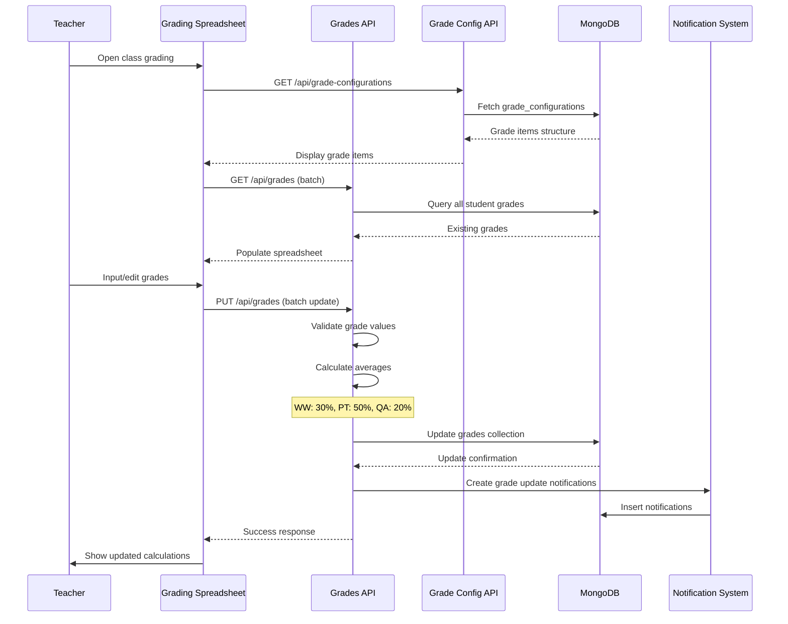
```mermaid
sequenceDiagram
    participant T as Teacher
    participant UI as Grading Spreadsheet
    participant API as Grades API
    participant Config as Grade Config API
    participant DB as MongoDB
    participant Notify as Notification System
    
    T->>UI: Open class grading
    UI->>Config: GET /api/grade-configurations
    Config->>DB: Fetch grade_configurations
    DB-->>Config: Grade items structure
    Config-->>UI: Display grade items
    
    UI->>API: GET /api/grades (batch)
    API->>DB: Query all student grades
    DB-->>API: Existing grades
    API-->>UI: Populate spreadsheet
    
    T->>UI: Input/edit grades
    UI->>API: PUT /api/grades (batch update)
    API->>API: Validate grade values
    API->>API: Calculate averages
    note over API: WW: 30%, PT: 50%, QA: 20%
    
    API->>DB: Update grades collection
    DB-->>API: Update confirmation
    API->>Notify: Create grade update notifications
    Notify->>DB: Insert notifications
    API-->>UI: Success response
    UI->>T: Show updated calculations
```

**Data Collections Involved:**
- `grade_configurations` (read)
- `grades` (read, update, create)
- `notifications` (create)
- `section_students` (read for roster)
- `users` (read for student info)

**Grade Calculation Formula:**
```javascript
// DepEd Grading System
final_grade = (
  (written_work_avg * 0.30) +
  (performance_tasks_avg * 0.50) +
  (quarterly_assessment_avg * 0.20)
)
```

---

### 6. Student Enrollment Flow

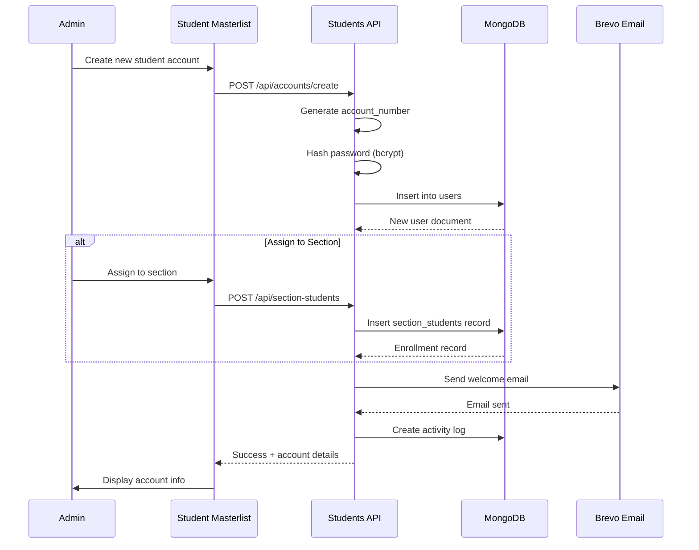
```mermaid
sequenceDiagram
    participant A as Admin
    participant UI as Student Masterlist
    participant API as Students API
    participant DB as MongoDB
    participant Email as Brevo Email
    
    A->>UI: Create new student account
    UI->>API: POST /api/accounts/create
    API->>API: Generate account_number
    API->>API: Hash password (bcrypt)
    API->>DB: Insert into users
    DB-->>API: New user document
    
    alt Assign to Section
        A->>UI: Assign to section
        UI->>API: POST /api/section-students
        API->>DB: Insert section_students record
        DB-->>API: Enrollment record
    end
    
    API->>Email: Send welcome email
    Email-->>API: Email sent
    API->>DB: Create activity log
    API-->>UI: Success + account details
    UI->>A: Display account info
```

**Data Collections Involved:**
- `users` (create)
- `section_students` (create)
- `activity_logs` (create)

**Account Number Generation:**
```javascript
// Format: YYYY-GL-XXXXX
// Example: 2024-7-00123
const year = new Date().getFullYear()
const gradeLevel = student.grade_level
const sequence = await getNextSequence(year, gradeLevel)
const accountNumber = `${year}-${gradeLevel}-${sequence.toString().padStart(5, '0')}`
```

---

### 7. Class Ranking Calculation Flow

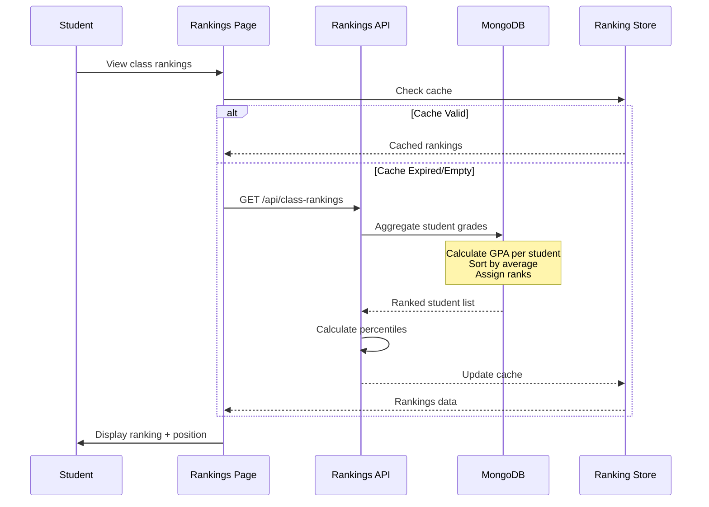
```mermaid
sequenceDiagram
    participant S as Student
    participant UI as Rankings Page
    participant API as Rankings API
    participant DB as MongoDB
    participant Store as Ranking Store
    
    S->>UI: View class rankings
    UI->>Store: Check cache
    
    alt Cache Valid
        Store-->>UI: Cached rankings
    else Cache Expired/Empty
        UI->>API: GET /api/class-rankings
        API->>DB: Aggregate student grades
        note over DB: Calculate GPA per student<br/>Sort by average<br/>Assign ranks
        
        DB-->>API: Ranked student list
        API->>API: Calculate percentiles
        API-->>Store: Update cache
        Store-->>UI: Rankings data
    end
    
    UI->>S: Display ranking + position
```

**Data Collections Involved:**
- `grades` (read)
- `section_students` (read)
- `users` (read)
- `sections` (read)

**Ranking Aggregation:**
```javascript
[
  { $match: { section_id, quarter, school_year } },
  { $group: {
      _id: "$student_id",
      average: { $avg: "$averages.final_grade" }
  }},
  { $sort: { average: -1 } },
  { $setWindowFields: {
      sortBy: { average: -1 },
      output: { rank: { $rank: {} } }
  }}
]
```

---

### 8. Notification Creation & Delivery Flow

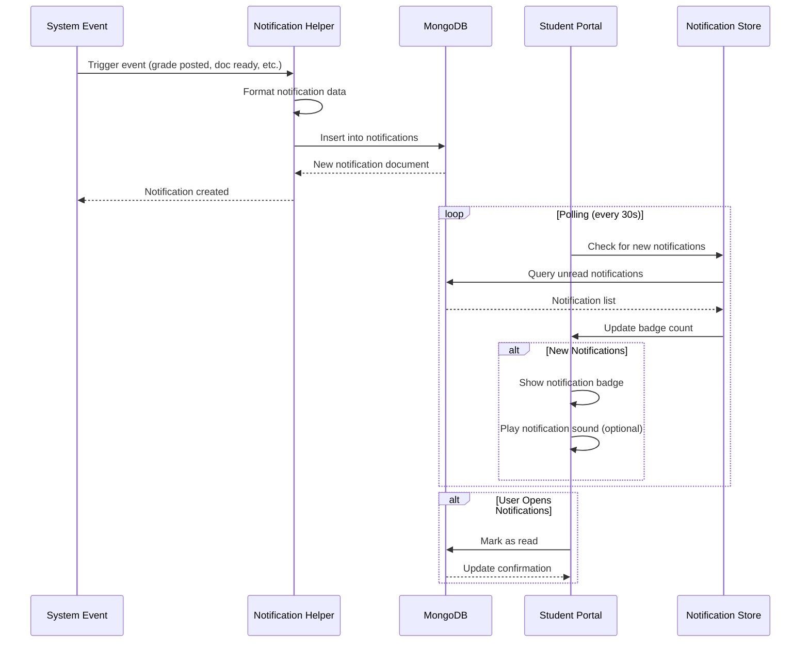
```mermaid
sequenceDiagram
    participant Sys as System Event
    participant Helper as Notification Helper
    participant DB as MongoDB
    participant UI as Student Portal
    participant Store as Notification Store
    
    Sys->>Helper: Trigger event (grade posted, doc ready, etc.)
    Helper->>Helper: Format notification data
    Helper->>DB: Insert into notifications
    DB-->>Helper: New notification document
    Helper-->>Sys: Notification created
    
    loop Polling (every 30s)
        UI->>Store: Check for new notifications
        Store->>DB: Query unread notifications
        DB-->>Store: Notification list
        Store->>UI: Update badge count
        
        alt New Notifications
            UI->>UI: Show notification badge
            UI->>UI: Play notification sound (optional)
        end
    end
    
    alt User Opens Notifications
        UI->>DB: Mark as read
        DB-->>UI: Update confirmation
    end
```

**Data Collections Involved:**
- `notifications` (create, read, update)

**Notification Types:**
- **grades**: New grades posted
- **schedule**: Schedule changes
- **documents**: Document request updates
- **todo**: Todo reminders

---

### 9. Password Reset Flow

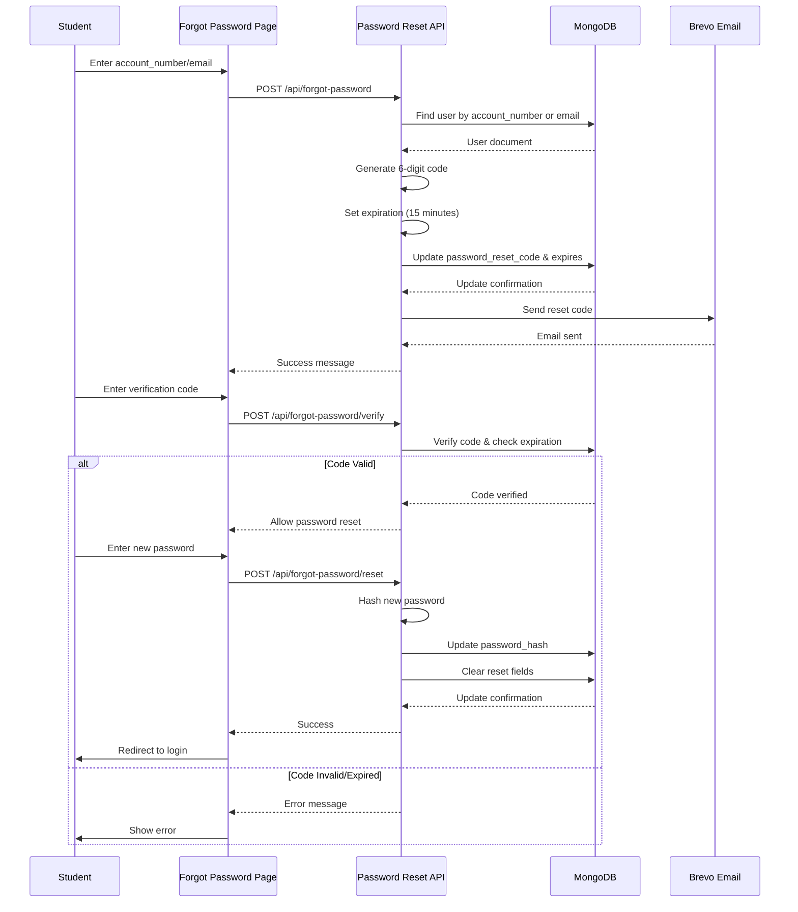
```mermaid
sequenceDiagram
    participant S as Student
    participant UI as Forgot Password Page
    participant API as Password Reset API
    participant DB as MongoDB
    participant Email as Brevo Email
    
    S->>UI: Enter account_number/email
    UI->>API: POST /api/forgot-password
    API->>DB: Find user by account_number or email
    DB-->>API: User document
    
    API->>API: Generate 6-digit code
    API->>API: Set expiration (15 minutes)
    API->>DB: Update password_reset_code & expires
    DB-->>API: Update confirmation
    
    API->>Email: Send reset code
    Email-->>API: Email sent
    API-->>UI: Success message
    
    S->>UI: Enter verification code
    UI->>API: POST /api/forgot-password/verify
    API->>DB: Verify code & check expiration
    
    alt Code Valid
        DB-->>API: Code verified
        API-->>UI: Allow password reset
        S->>UI: Enter new password
        UI->>API: POST /api/forgot-password/reset
        API->>API: Hash new password
        API->>DB: Update password_hash
        API->>DB: Clear reset fields
        DB-->>API: Update confirmation
        API-->>UI: Success
        UI->>S: Redirect to login
    else Code Invalid/Expired
        API-->>UI: Error message
        UI->>S: Show error
    end
```

**Data Collections Involved:**
- `users` (read, update)
- `activity_logs` (create)

**Security Features:**
- 6-digit verification code
- 15-minute expiration
- Code invalidated after use
- Rate limiting on attempts

---

### 10. Student Profile Data Flow

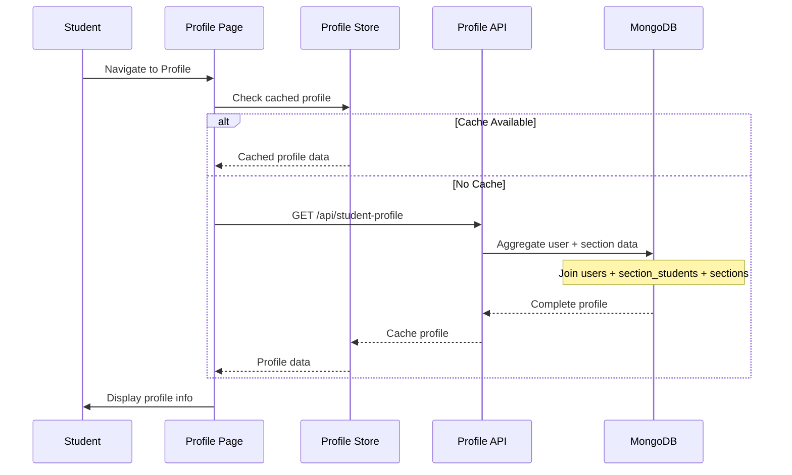
```mermaid
sequenceDiagram
    participant S as Student
    participant UI as Profile Page
    participant Store as Profile Store
    participant API as Profile API
    participant DB as MongoDB
    
    S->>UI: Navigate to Profile
    UI->>Store: Check cached profile
    
    alt Cache Available
        Store-->>UI: Cached profile data
    else No Cache
        UI->>API: GET /api/student-profile
        API->>DB: Aggregate user + section data
        note over DB: Join users + section_students + sections
        DB-->>API: Complete profile
        API-->>Store: Cache profile
        Store-->>UI: Profile data
    end
    
    UI->>S: Display profile info
```

**Data Aggregation:**
```javascript
[
  { $match: { _id: ObjectId(studentId) } },
  { $lookup: {
      from: "section_students",
      let: { student_id: "$_id" },
      pipeline: [
        { $match: { status: "active" } },
        { $lookup: { from: "sections", ... } }
      ]
  }},
  { $addFields: {
      current_section: { $arrayElemAt: ["$enrollments.section", 0] }
  }}
]
```

---

### 11. Todo List Management Flow

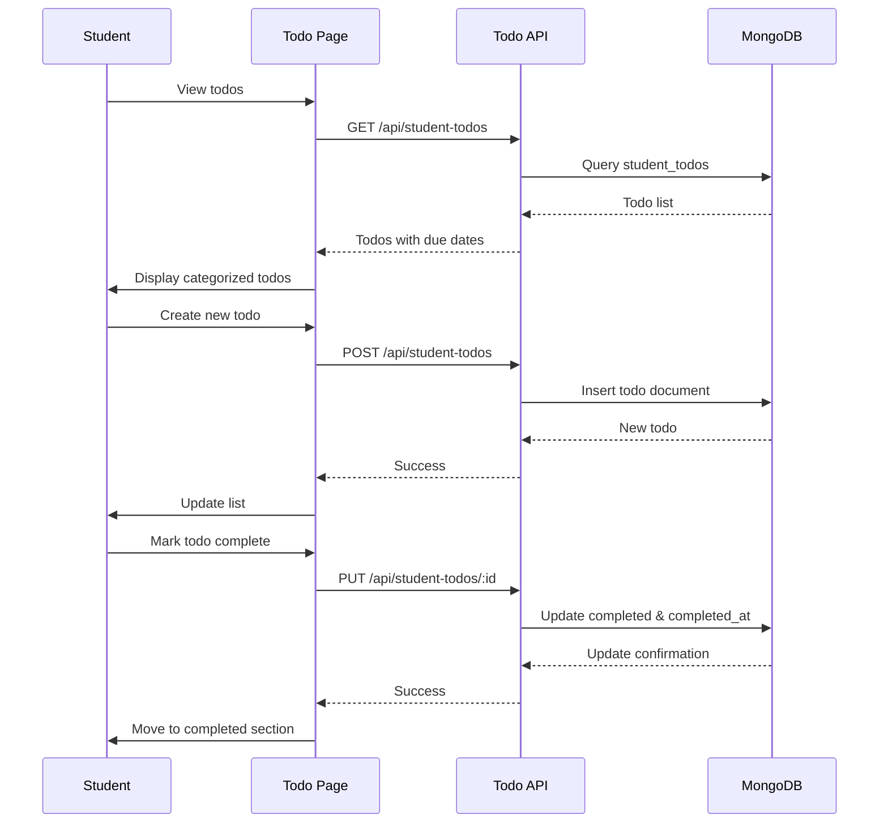
```mermaid
sequenceDiagram
    participant S as Student
    participant UI as Todo Page
    participant API as Todo API
    participant DB as MongoDB
    
    S->>UI: View todos
    UI->>API: GET /api/student-todos
    API->>DB: Query student_todos
    DB-->>API: Todo list
    API-->>UI: Todos with due dates
    UI->>S: Display categorized todos
    
    S->>UI: Create new todo
    UI->>API: POST /api/student-todos
    API->>DB: Insert todo document
    DB-->>API: New todo
    API-->>UI: Success
    UI->>S: Update list
    
    S->>UI: Mark todo complete
    UI->>API: PUT /api/student-todos/:id
    API->>DB: Update completed & completed_at
    DB-->>API: Update confirmation
    API-->>UI: Success
    UI->>S: Move to completed section
```

**Data Collections Involved:**
- `student_todos` (create, read, update, delete)

**Todo Categories:**
- assignment
- study
- project
- exam
- other

---

## Data Validation & Business Rules

### Input Validation Flow

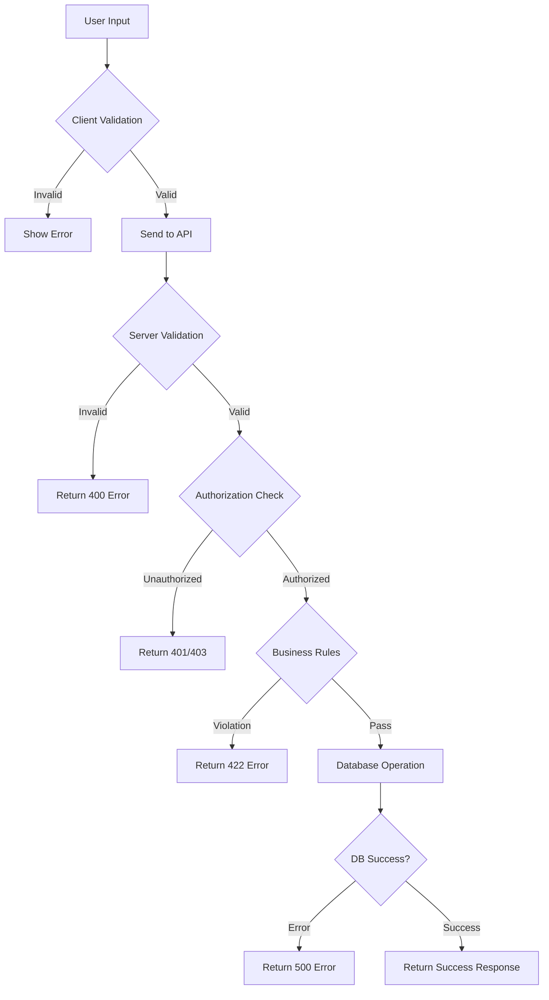
```mermaid
flowchart TD
    A[User Input] --> B{Client Validation}
    B -->|Invalid| C[Show Error]
    B -->|Valid| D[Send to API]
    D --> E{Server Validation}
    E -->|Invalid| F[Return 400 Error]
    E -->|Valid| G{Authorization Check}
    G -->|Unauthorized| H[Return 401/403]
    G -->|Authorized| I{Business Rules}
    I -->|Violation| J[Return 422 Error]
    I -->|Pass| K[Database Operation]
    K --> L{DB Success?}
    L -->|Error| M[Return 500 Error]
    L -->|Success| N[Return Success Response]
```

### Common Validations

**Student Grade Input:**
- Value range: 0-100
- Max 2 decimal places
- Required for all grade items
- Cannot modify verified grades

**Document Request:**
- Valid document type
- Quantity > 0
- Purpose required if urgent
- Valid birthdate format

**Schedule Entry:**
- No time conflicts
- Valid time format (HH:MM)
- end_time > start_time
- Valid day_of_week

---

## Caching Strategy

### Client-Side Caching

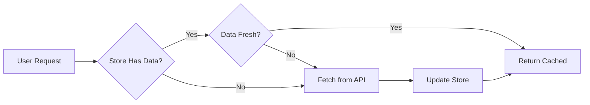
```mermaid
flowchart LR
    A[User Request] --> B{Store Has Data?}
    B -->|Yes| C{Data Fresh?}
    B -->|No| D[Fetch from API]
    C -->|Yes| E[Return Cached]
    C -->|No| D
    D --> F[Update Store]
    F --> E
```

**Cache Durations:**
- Profile: 5 minutes
- Grades: 30 seconds
- Schedule: 1 hour
- Notifications: Real-time polling (30s interval)

### Server-Side Caching

**AI Analysis Cache:**
- Duration: 7 days
- Key: `${student_id}_${quarter}_${school_year}`
- Invalidation: Manual refresh or TTL expiry

---

## Error Handling Flow

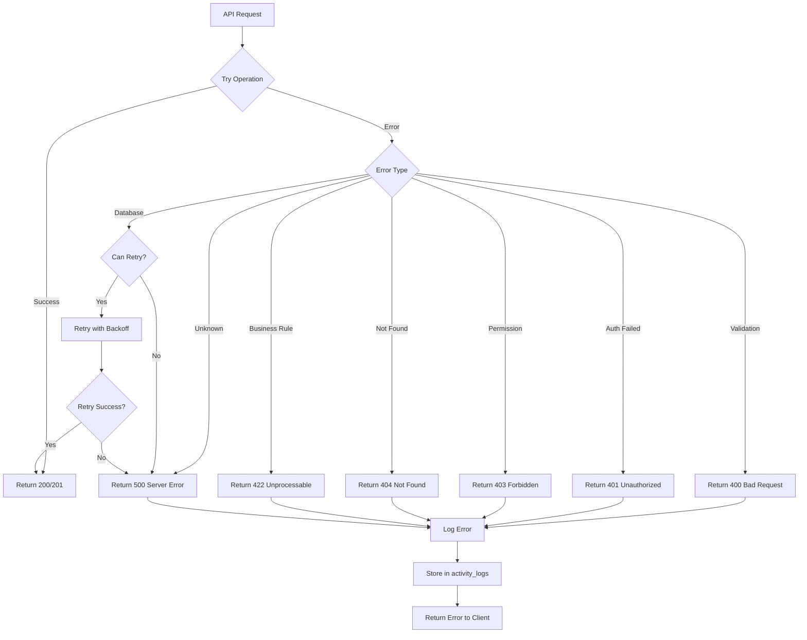
```mermaid
flowchart TD
    A[API Request] --> B{Try Operation}
    B -->|Success| C[Return 200/201]
    B -->|Error| D{Error Type}
    
    D -->|Validation| E[Return 400 Bad Request]
    D -->|Auth Failed| F[Return 401 Unauthorized]
    D -->|Permission| G[Return 403 Forbidden]
    D -->|Not Found| H[Return 404 Not Found]
    D -->|Business Rule| I[Return 422 Unprocessable]
    D -->|Database| J{Can Retry?}
    D -->|Unknown| K[Return 500 Server Error]
    
    J -->|Yes| L[Retry with Backoff]
    J -->|No| K
    
    L --> M{Retry Success?}
    M -->|Yes| C
    M -->|No| K
    
    E --> N[Log Error]
    F --> N
    G --> N
    H --> N
    I --> N
    K --> N
    
    N --> O[Store in activity_logs]
    O --> P[Return Error to Client]
```

---

## Performance Optimization Strategies

### Database Query Optimization

1. **Use Indexes**
   - Index frequently queried fields
   - Compound indexes for multi-field queries
   - Sparse indexes for optional fields

2. **Aggregation Pipelines**
   - Pre-join related data
   - Reduce round trips
   - Use `$project` to limit fields

3. **Batch Operations**
   - Bulk grade updates
   - Batch notifications
   - Minimize database calls

### API Response Optimization

1. **Field Selection**
   ```javascript
   // Only return needed fields
   db.users.find({}, { password_hash: 0, password_reset_code: 0 })
   ```

2. **Pagination**
   ```javascript
   // Limit results for large datasets
   .skip((page - 1) * limit).limit(limit)
   ```

3. **Response Compression**
   - Gzip compression enabled
   - Minify JSON responses

---

## Security Data Flows

### Authentication Token Flow

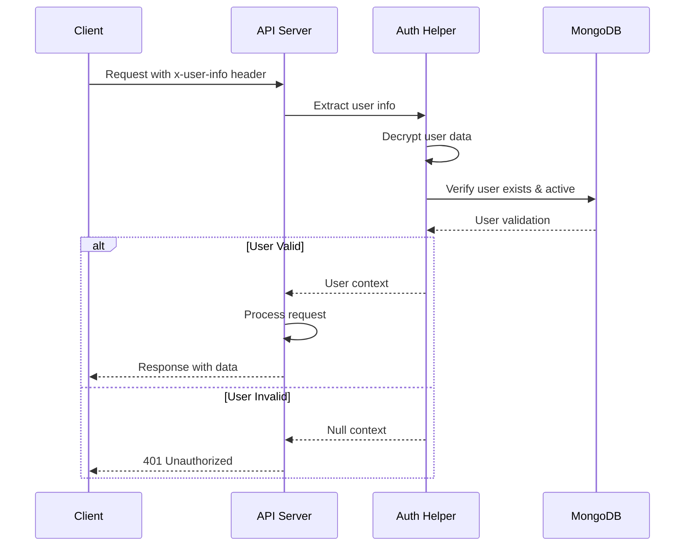
```mermaid
sequenceDiagram
    participant C as Client
    participant API as API Server
    participant Auth as Auth Helper
    participant DB as MongoDB
    
    C->>API: Request with x-user-info header
    API->>Auth: Extract user info
    Auth->>Auth: Decrypt user data
    Auth->>DB: Verify user exists & active
    DB-->>Auth: User validation
    
    alt User Valid
        Auth-->>API: User context
        API->>API: Process request
        API-->>C: Response with data
    else User Invalid
        Auth-->>API: Null context
        API-->>C: 401 Unauthorized
    end
```

### Data Encryption Points

- **Password Storage**: Bcrypt hashed (12 rounds)
- **Sensitive Data**: Encrypted using encryption-helper
- **Transport**: HTTPS in production
- **Session Data**: Encrypted client-side storage

---

## Monitoring & Logging

### Activity Logging

**Logged Events:**
- User login/logout
- Grade modifications
- Document request submissions
- Schedule changes
- Account creations
- Admin actions

**Log Structure:**
```javascript
{
  activity_type: "string",
  user_id: ObjectId,
  user_account_number: "string",
  activity_data: { /* event-specific data */ },
  ip_address: "string",
  user_agent: "string",
  created_at: Date
}
```

---

## Data Retention Policies

| Collection | Retention | Archive Strategy |
|-----------|-----------|------------------|
| users | Indefinite | Soft delete (archived_at) |
| grades | Indefinite | Historical record |
| document_requests | 5 years | Compliance requirement |
| notifications | 1 year | Auto-delete old |
| activity_logs | 2 years | Archive to cold storage |
| student_todos | Active only | Delete 1 year after completion |
| ai_grade_analysis_cache | 7 days | Auto-expire |

---

## Integration Points

### External Service Integrations

**Brevo Email API:**
- Welcome emails
- Password reset codes
- Document ready notifications
- Grade report emails

**OpenRouter AI API:**
- Grade performance analysis
- Study recommendations
- Trend identification

---

## Change Log

| Version | Date | Changes |
|---------|------|---------|
| 1.0 | 2024-11-30 | Initial SS1 data flow documentation |

---

**Note**: This data flow diagram focuses on SS1 (Student Information System) processes. All flows are designed with security, performance, and data integrity as primary concerns.
