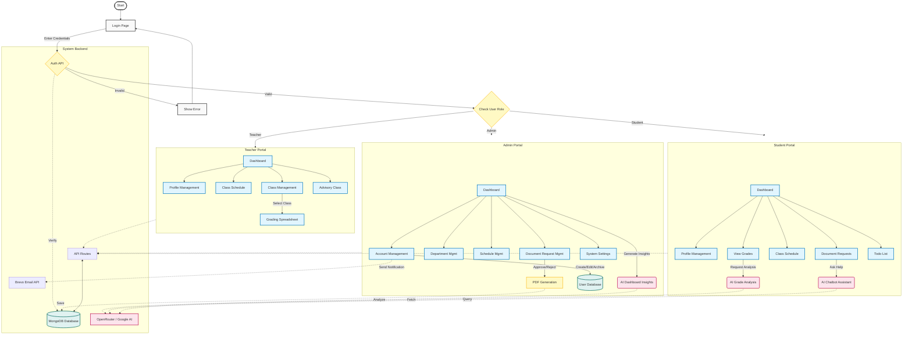

```mermaid
flowchart TD
    %% Global Styles
    classDef startend fill:#f9f9f9,stroke:#333,stroke-width:2px;
    classDef process fill:#e1f5fe,stroke:#0277bd,stroke-width:2px;
    classDef decision fill:#fff9c4,stroke:#fbc02d,stroke-width:2px;
    classDef database fill:#e0f2f1,stroke:#00695c,stroke-width:2px;
    classDef portal fill:#f3e5f5,stroke:#7b1fa2,stroke-width:2px,stroke-dasharray: 5 5;
    classDef ai fill:#fce4ec,stroke:#c2185b,stroke-width:2px;

    Start([Start]) --> Login[Login Page]
    Login -->|Enter Credentials| AuthAPI{Auth API}
    
    %% Authentication Flow
    AuthAPI -->|Invalid| LoginError[Show Error]
    LoginError --> Login
    AuthAPI -->|Valid| GetRole{Check User Role}
    
    %% Role Routing
    GetRole -->|Student| StudentPortal
    GetRole -->|Teacher| TeacherPortal
    GetRole -->|Admin| AdminPortal

    %% Student Portal Subsystem
    subgraph StudentPortal [Student Portal]
        direction TB
        SP_Dash[Dashboard]
        SP_Profile[Profile Management]
        SP_Grades[View Grades]
        SP_AI_Analysis(AI Grade Analysis)
        SP_Schedule[Class Schedule]
        SP_Docs[Document Requests]
        SP_Chatbot(AI Chatbot Assistant)
        SP_Todos[Todo List]
        
        SP_Dash --> SP_Profile
        SP_Dash --> SP_Grades
        SP_Grades -->|Request Analysis| SP_AI_Analysis
        SP_Dash --> SP_Schedule
        SP_Dash --> SP_Docs
        SP_Docs -->|Ask Help| SP_Chatbot
        SP_Dash --> SP_Todos
    end

    %% Teacher Portal Subsystem
    subgraph TeacherPortal [Teacher Portal]
        direction TB
        TP_Dash[Dashboard]
        TP_Profile[Profile Management]
        TP_Schedule[Class Schedule]
        TP_Classes[Class Management]
        TP_Grading[Grading Spreadsheet]
        TP_Advisory[Advisory Class]
        
        TP_Dash --> TP_Profile
        TP_Dash --> TP_Schedule
        TP_Dash --> TP_Classes
        TP_Classes -->|Select Class| TP_Grading
        TP_Dash --> TP_Advisory
    end

    %% Admin Portal Subsystem
    subgraph AdminPortal [Admin Portal]
        direction TB
        AP_Dash[Dashboard]
        AP_AI_Insights(AI Dashboard Insights)
        AP_Accts[Account Management]
        AP_Depts[Department Mgmt]
        AP_Sched[Schedule Mgmt]
        AP_Docs[Document Request Mgmt]
        AP_Settings[System Settings]
        
        AP_Dash -->|Generate Insights| AP_AI_Insights
        AP_Dash --> AP_Accts
        AP_Dash --> AP_Depts
        AP_Dash --> AP_Sched
        AP_Dash --> AP_Docs
        AP_Dash --> AP_Settings
        
        AP_Accts -->|Create/Edit/Archive| DB_Users[(User Database)]
        AP_Docs -->|Approve/Reject| PDF_Gen[PDF Generation]
    end

    %% Backend Services & Data
    subgraph Backend [System Backend]
        DB_Main[(MongoDB Database)]
        API_Routes[API Routes]
        Ext_AI[OpenRouter / Google AI]
        Ext_Email[Brevo Email API]
        
        SP_AI_Analysis -.->|Fetch| Ext_AI
        SP_Chatbot -.->|Query| Ext_AI
        AP_AI_Insights -.->|Analyze| Ext_AI
        
        AuthAPI -.->|Verify| DB_Main
        PDF_Gen -.->|Save| DB_Main
        
        AP_Accts -.->|Send Notification| Ext_Email
    end

    %% Connections to Backend
    StudentPortal -.-> API_Routes
    TeacherPortal -.-> API_Routes
    AdminPortal -.-> API_Routes
    API_Routes <--> DB_Main

    %% Styling
    class Start,Login,LoginError startend;
    class AuthAPI,GetRole,PDF_Gen decision;
    class SP_Dash,SP_Profile,SP_Grades,SP_Schedule,SP_Docs,SP_Todos process;
    class TP_Dash,TP_Profile,TP_Schedule,TP_Classes,TP_Grading,TP_Advisory process;
    class AP_Dash,AP_Accts,AP_Depts,AP_Sched,AP_Docs,AP_Settings process;
    class DB_Users,DB_Main database;
    class SP_AI_Analysis,SP_Chatbot,AP_AI_Insights,Ext_AI ai;
```
