# 📊 SS1 (Student Information System) Flowchart

> **Branch**: SS1 - Student Information System  
> **Version**: 1.0  
> **Last Updated**: February 2026

This document provides comprehensive visual flowcharts for the SS1 (Student Information System) branch of the SET-2 High School Student Information System.

---

## 📋 Table of Contents

1. [System Overview](#system-overview)
2. [Main System Flow](#main-system-flow)
3. [User Authentication Flow](#user-authentication-flow)
4. [Student Portal Flow](#student-portal-flow)
5. [Teacher Portal Flow](#teacher-portal-flow)
6. [Admin Portal Flow](#admin-portal-flow)
7. [Data Processing Flow](#data-processing-flow)
8. [Notification System Flow](#notification-system-flow)
9. [Grade Management Flow](#grade-management-flow)
10. [Security & Access Control Flow](#security--access-control-flow)

---

## System Overview

### 🏗️ High-Level Architecture

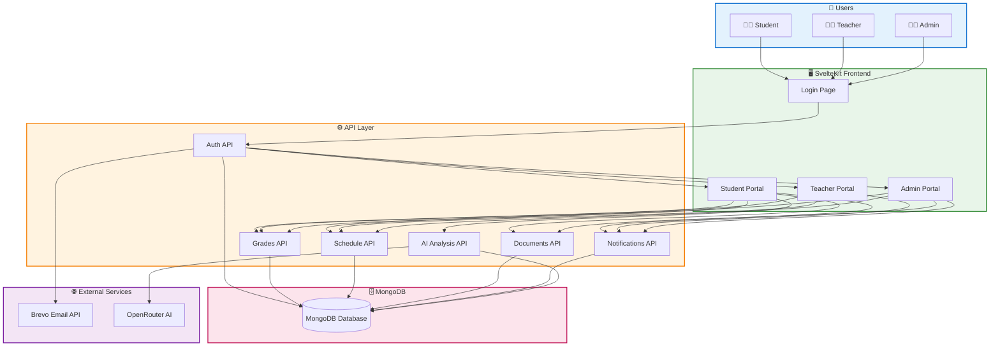

---

## Main System Flow

### 🔄 Complete System Workflow

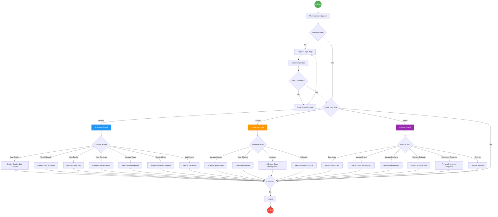

---

## User Authentication Flow

### 🔐 Login Process

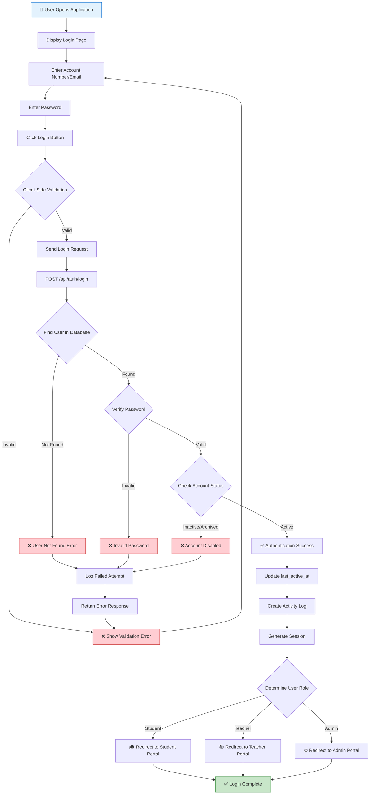

### 🔑 Password Reset Flow

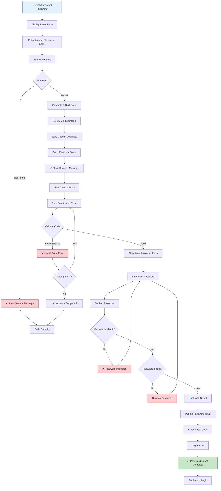

---

## Student Portal Flow

### 📚 Student Portal Navigation

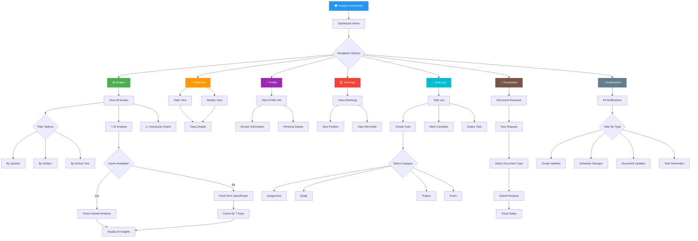

### 📊 Grade Viewing Flow

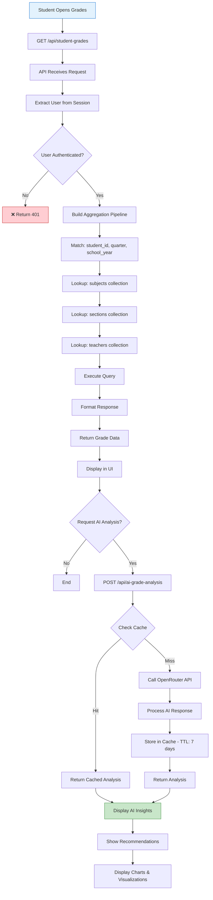

---

## Teacher Portal Flow

### 📝 Teacher Portal Navigation

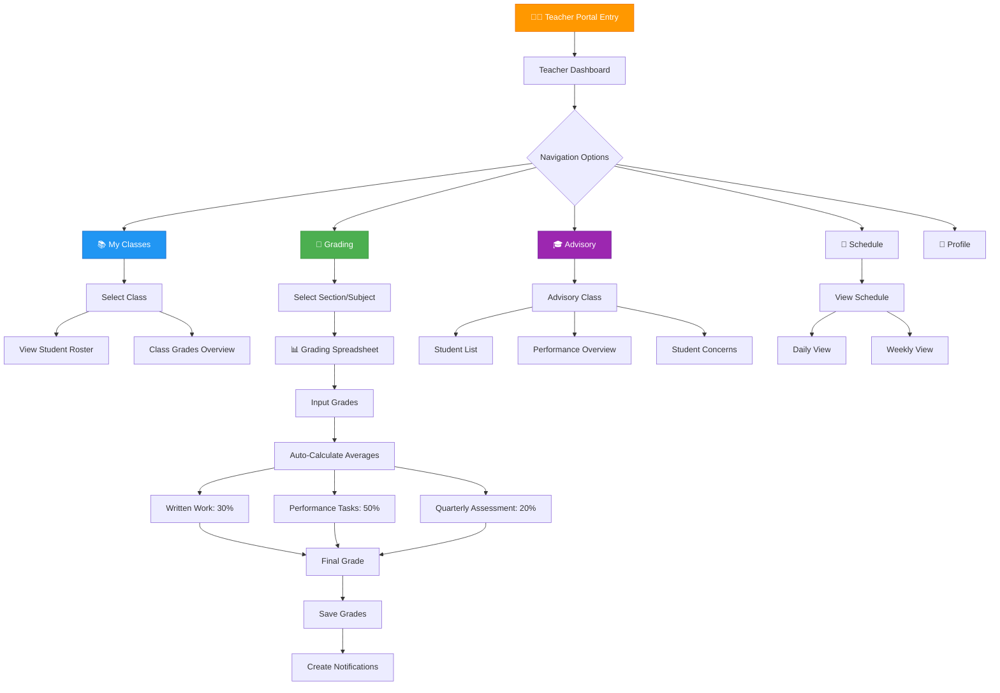

### 📝 Grade Input Workflow

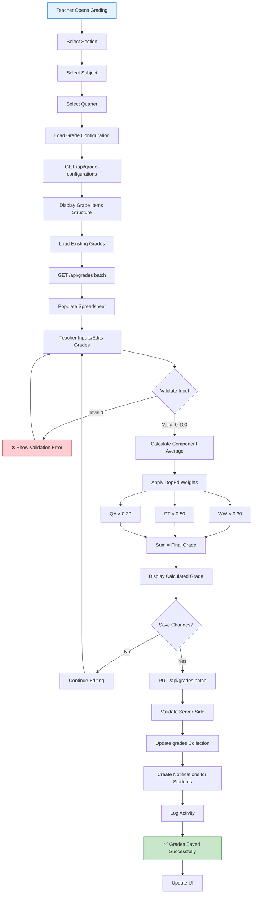

---

## Admin Portal Flow

### ⚙️ Admin Portal Navigation

```mermaid
flowchart TD
    ENTRY[👨‍💼 Admin Portal Entry] --> DASHBOARD[📊 Admin Dashboard]
    
    DASHBOARD --> STATS[System Statistics]
    STATS --> CHARTS[Interactive Charts]
    CHARTS --> C1[Students per Grade Level]
    CHARTS --> C2[Sections per Grade Level]
    CHARTS --> C3[Document Request Status]
    
    DASHBOARD --> NAV{Navigation Options}
    
    NAV --> ACCOUNTS[👥 User Accounts]
    NAV --> STUDENTS[🎓 Student Management]
    NAV --> SECTIONS[📚 Sections]
    NAV --> SUBJECTS[📖 Subjects]
    NAV --> SCHEDULES[📅 Schedules]
    NAV --> DOCUMENTS[📄 Documents]
    NAV --> SETTINGS[⚙️ Settings]
    
    ACCOUNTS --> ACC_CREATE[Create Account]
    ACCOUNTS --> ACC_LIST[List Accounts]
    ACCOUNTS --> ACC_EDIT[Edit Account]
    
    STUDENTS --> STU_LIST[Student Masterlist]
    STUDENTS --> STU_CREATE[Add Student]
    STUDENTS --> STU_ARCHIVE[Archive/Restore]
    STUDENTS --> STU_GRADES[View Grades]
    STUDENTS --> STU_BULK[Bulk Import/Export]
    
    SECTIONS --> SEC_LIST[List Sections]
    SECTIONS --> SEC_CREATE[Create Section]
    SECTIONS --> SEC_ASSIGN[Assign Students]
    SECTIONS --> SEC_ADVISOR[Assign Advisor]
    
    SUBJECTS --> SUB_LIST[List Subjects]
    SUBJECTS --> SUB_CREATE[Create Subject]
    SUBJECTS --> SUB_DEPED[DepEd Alignment]
    
    SCHEDULES --> SCHED_ROOMS[Room Management]
    SCHEDULES --> SCHED_TIME[Time Slots]
    SCHEDULES --> SCHED_ASSIGN[Schedule Assignment]
    
    DOCUMENTS --> DOC_PENDING[Pending Requests]
    DOCUMENTS --> DOC_APPROVED[Approved]
    DOCUMENTS --> DOC_COMPLETE[Completed]
    DOCUMENTS --> DOC_PROCESS[Process Request]
    
    SETTINGS --> SET_YEAR[School Year]
    SETTINGS --> SET_QUARTER[Current Quarter]
    SETTINGS --> SET_CONFIG[System Configuration]

    style ENTRY fill:#9c27b0,stroke:#6a1b9a,color:#fff
    style DASHBOARD fill:#673ab7,stroke:#512da8,color:#fff
    style ACCOUNTS fill:#2196f3,stroke:#1565c0,color:#fff
    style STUDENTS fill:#4caf50,stroke:#388e3c,color:#fff
    style SECTIONS fill:#ff9800,stroke:#ef6c00,color:#fff
    style SUBJECTS fill:#f44336,stroke:#c62828,color:#fff
    style DOCUMENTS fill:#795548,stroke:#5d4037,color:#fff
```

### 👤 Account Creation Flow

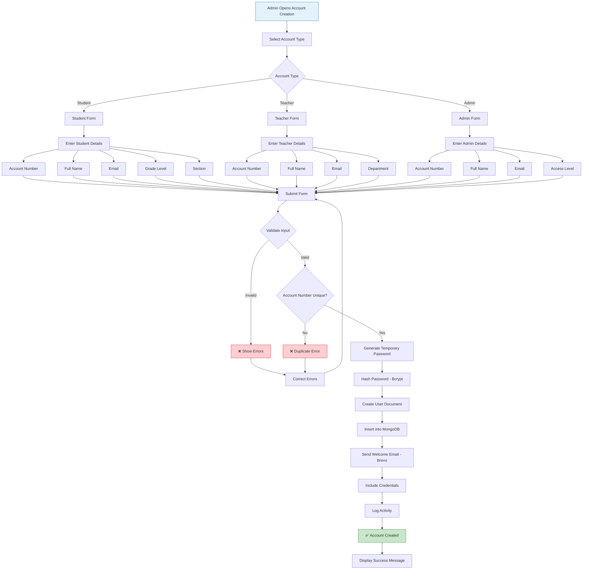

---

## Data Processing Flow

### 🗄️ Database Operations

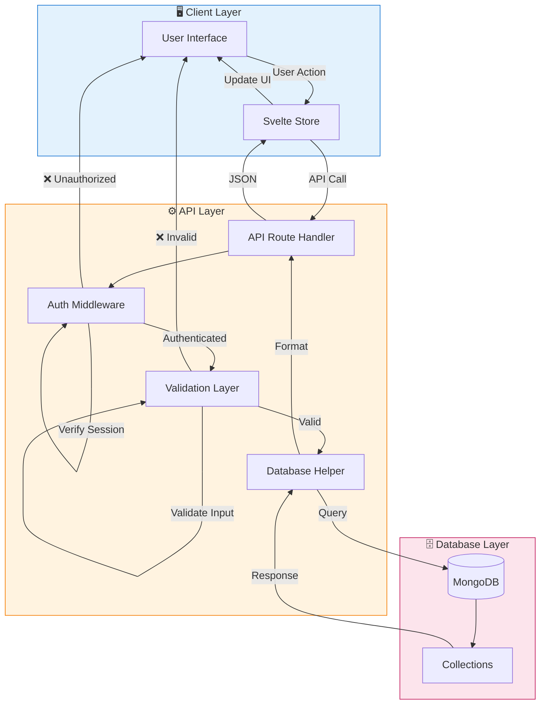

### 📊 Data Aggregation Pipeline

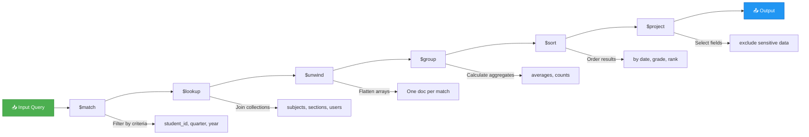

---

## Notification System Flow

### 🔔 Notification Lifecycle

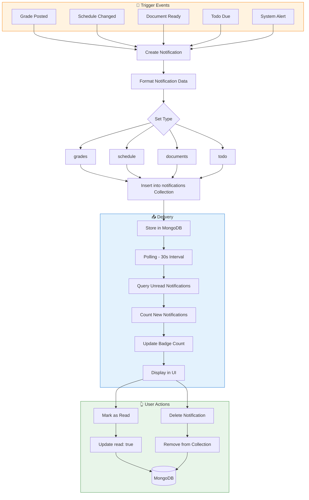

---

## Grade Management Flow

### 📈 Complete Grading Workflow

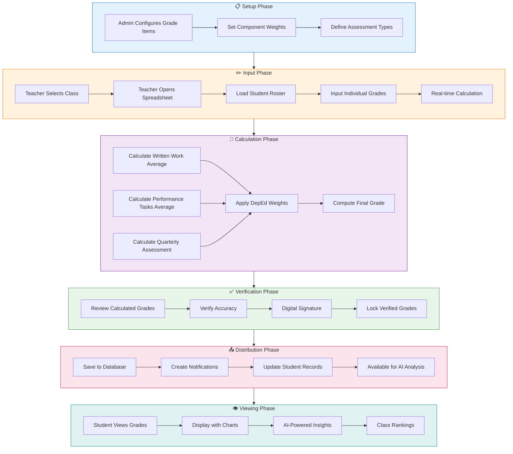

---

## Security & Access Control Flow

### 🔒 Authentication & Authorization

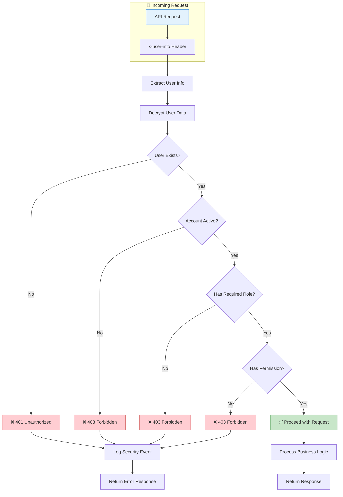

### 🛡️ Role-Based Access Control

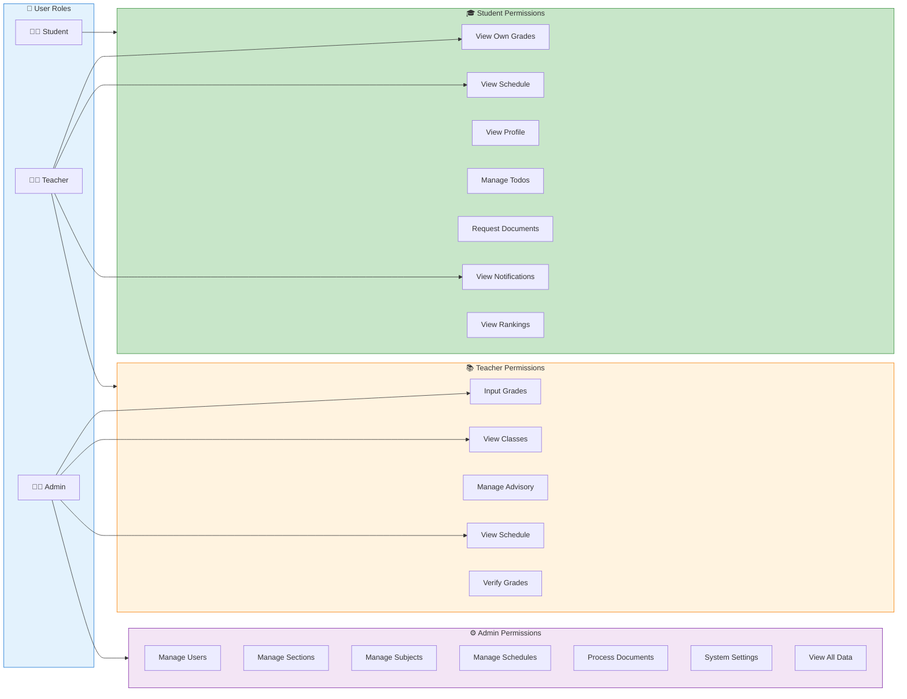

---

## 📚 Legend

| Symbol | Meaning |
|--------|---------|
| 🚀 | Start Point |
| 🔚 | End Point |
| ❌ | Error/Failure |
| ✅ | Success |
| 👨‍🎓 | Student |
| 👨‍🏫 | Teacher |
| 👨‍💼 | Admin |
| 📊 | Data/Analytics |
| 🔐 | Security |
| 🔔 | Notification |
| 📧 | Email |
| 🤖 | AI/Automation |

---

## 📝 Notes

- All flowcharts use Mermaid syntax for GitHub markdown rendering
- Colors follow Material Design 3 guidelines for consistency
- Arrows indicate data flow direction
- Diamond shapes (◇) represent decision points
- Rectangular shapes (□) represent processes or actions
- Rounded rectangles represent start/end points

---

> **Document Version**: 1.0  
> **Created For**: SET-2 High School Student Information System  
> **Branch Focus**: SS1 (Student Information System)
