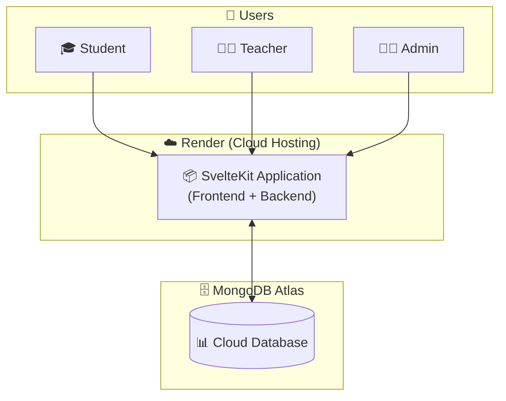

# System Architecture

A simple overview of the SET-2 Student Information System architecture.

## Architecture Diagram

## Explanation

### Components

| Component | Description |
|-----------|-------------|
| **Users** | Students, Teachers, and Admins access the system through web browsers |
| **Render** | Cloud hosting platform that runs our SvelteKit application |
| **SvelteKit App** | Full-stack application that handles both the user interface (frontend) and server logic (backend API) |
| **MongoDB Atlas** | Cloud-hosted database that stores all system data (students, grades, schedules, etc.) |

### How It Works

1. **Users** (Students, Teachers, Admins) access the application through their web browsers
2. The **SvelteKit Application** hosted on **Render** serves the web pages and handles all requests
3. When data is needed (like grades or schedules), the application communicates with **MongoDB Atlas**
4. MongoDB Atlas stores and retrieves data, then sends it back to the application
5. The application displays the data to the users

### Technology Stack

- **Frontend**: Svelte 5 with Material Design 3
- **Backend**: SvelteKit (Node.js)
- **Database**: MongoDB Atlas (Cloud)
- **Hosting**: Render (Cloud)
